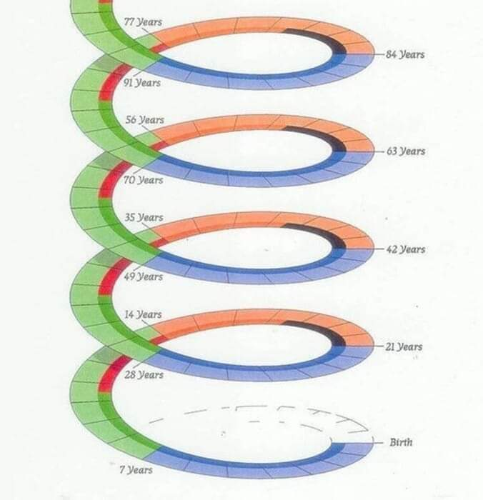

[Home](Readme.md)
# Misc stuff related to psychology and motivation

---

**Contents**

- [Miscellaneous](Motivation.md#miscellaneous)

---

## Miscellaneous

---

"Fairness is a concept invented so dumb people and children can participate in debates". Scott Adams

---

Разреши другим разочароваться в тебе.
И ты будешь свободен жить так, как ты на самом деле чувствуешь.

Разреши себе не нравиться другим.
И ты сможешь понять, чего ты на самом деле хочешь.

Разреши себе успевать не все. И ты будешь успевать то, что действительно важно.

Разреши себе грустить или злиться. И ты больше не будешь страдать от тревоги.

Разреши себе уставать и отдыхать, когда ты устал. И ты сохранишь и преумножишь своё здоровье.

Разреши себе завидовать. И ты получишь ориентиры, в какую сторону двигаться.

Разреши другим быть другими. И у тебя прибавится энергии, которая в противном случае тратится на оценку, критику или одобрение чужих действий.

Разреши себе быть слабым. И ты узнаешь, что ты намного сильнее, чем думаешь.

Разреши себе не иметь оригинальных хобби и в чём-то не разбираться. И жизнь станет ярче и интереснее.

Разреши себе горевать о потерях. И сложные чувства не проникнут в твои очередные начинания и новые отношения.

Разреши себе быть обычным. Ты расслабишься и тут же станешь по-настоящему уникальным.

Разреши себе быть неидеальным ребёнком и не самым лучшим родителем. И ты сможешь сформировать настоящую близость со своей семьей.

Разреши себе говорить, что тебе не нравится. И ты освободишь окружающих от необходимости догадываться и нести ответственность за твоё настроение.

Разреши себе злиться. И ты постепенно научишься отстаивать свои границы.

Разреши себе отчаиваться и прожить бессилие. И жизнь предоставить тебе новые, более крепкие опоры.

Разреши себе быть неэффективным. И ты узнаешь, что твоя ценность не в результатах.

Разреши себе опуститься на эмоциональное дно. И ты выплывешь с жемчужиной в виде новой жизненной ценности.

Разреши себе быть и размещать в пространстве жизни любые, даже самые неугодные чувства. И тогда ты научишься радоваться в полную силу, искренне и без страха.

Катерина Суратова

Вселенная Мудрости

---

ЕСЛИ КАЖЕТСЯ, ЧТО ВСЕ ИДЕТ НАПЕРЕКОСЯК, ПРОСТО ВСПОМНИТЕ ОБ ЭТИХ 8 ВЕЩАХ
(Перевод статьи «8 Things to Remember When Everything Goes Wrong»)

1. Боль является частью роста

Иногда жизнь закрывает дверь, потому что пора двигаться вперёд. Это даже хорошо, потому что часто мы
не начинаем движение, пока обстоятельства не вынудят нас. Когда наступают тяжёлые времена, напоминайте
себе, что нет боли без цели. Двигайтесь от того, что причиняет Вам боль, но никогда не забывайте урок,
который она преподаёт Вам. То, что Вы боретесь, не означает, что Вы терпите неудачу. Каждый большой успех
требует достойной борьбы. Всё наладится; скорее всего, не через мгновение, но в конечном счете всё будет…
Помните, что есть два вида боли: боль, которая причиняет боль, и боль, которая изменяет Вас. Вместо того,
чтобы сопротивляться этой боли, дайте ей помочь Вам.

2. Всё в нашей жизни - временно

Всегда, когда идёт дождь, мы знаем, что он закончится. Каждый раз, когда Вам причиняют боль, рана заживает.
После ночи всегда наступает день – каждое утро напоминает Вам об этом, но тем не менее Вы часто забываете это
и полагаете, что ночь продлится всегда. Ничто не длится вечно. И это тоже пройдет.

Если всё хорошо прямо сейчас, наслаждайтесь этим, потому что так не будет длиться вечно. Если всё плохо, не
волнуйтесь – и это не навсегда. То, что жизнь не легка в данный момент, не означает, что Вы не можете
смеяться. Если вас что-то беспокоит, это не означает, что Вы не можете улыбнуться. Каждый момент даёт Вам
новое начало и новое окончание. Каждую секунду Вы получаете второй шанс. Шанс, который Вы должны использовать.

3. Волнение и жалобы ничего не изменят

Те, кто жалуются больше всех, добиваются меньше всех. Всегда лучше попытаться сделать что-то большее и
потерпеть неудачу, чем ничего не сделать и преуспеть. Ничто не закончено, если Вы проиграли; всё закончено,
если Вы только жалуетесь. Если Вы верите во что-то, продолжайте пытаться. Не позволяйте теням прошлого затмевать
Ваше будущее. Позвольте приобретенному опыту улучшить вашу жизнь. И независимо от того, что произойдёт в конечном
счёте, помните - истинное счастье начинает прибывать только тогда, когда Вы прекращаете жаловаться на Ваши проблемы
и начинаете быть благодарными за все те проблемы, которых у Вас нет.

4. Ваши шрамы являются символами Вашей силы

Никогда не стыдитесь шрамов, которые подарила вам жизнь. Шрам означает, что боли больше нет, и рана затянулась.
Это означает, что Вы победили боль, извлекли урок, стали более сильными и продвинулись. Шрам является татуировкой
триумфа. Не позволяйте Вашим шрамам держать Вас в заложниках. Не позволяйте им заставлять Вас жить в страхе. Вы
не можете заставить шрамы исчезнуть, но Вы можете начать рассматривать их как признак силы.

Руми однажды сказал: «Рана является местом, где Свет входит в Вас». Ничто не может быть ближе к правде. Из
страдания появились самые сильные души; самые влиятельные люди в этом большом мире помечены шрамами. Посмотрите
на свои шрамы как на лозунг: «ДА! Я СДЕЛАЛ ЭТО! Я выжил, и у меня есть шрамы, чтобы доказать это! И теперь у меня
есть шанс стать ещё сильнее».

5. Каждая небольшая борьба является шагом вперёд

Терпение – не в ожидании; оно в способности сохранять хорошее настроение, упорно работая на Ваши мечты. Поэтому,
если Вы собираетесь попробовать, идите до конца. Иначе в старте нет никакого смысла. Это может означать потерю
стабильности и комфорта на некоторое время. Возможно, вы не сможете есть то, что Вы привыкли, или спать столько,
сколько Вы привыкли, в течение многих недель подряд. Это может означать изменение Вашей зоны комфорта. Это может
означать жертвование отношениями и всем, что Вам знакомо. Это может означать появление времени, которое Вы
проведёте в одиночестве. Но именно одиночество делает многие вещи возможными. Это своеобразный тест на выдержку,
на то, насколько Вы действительно хотите достичь цели. И тогда Вы поймёте, что борьба — не преграда на пути,
это — путь. И он стоит того. Нет лучшего чувства в мире… чем осознание того, что вы ЖИВЫ.

6. Отрицательность других людей – не Ваша проблема

Будьте уверены, когда плохое окружает Вас. Улыбайтесь, когда другие попытаются победить Вас. Это – лёгкий способ
поддержать собственный энтузиазм. Когда другие люди будут говорить о Вас плохо, продолжайте быть собой. Не
позволяйте другим менять себя. Вы не можете принимать всё слишком близко, даже если это кажется личным. Не
думайте, что люди делают что-то ради Вас. Они делают что-то ради себя.

Прежде всего, никогда не меняйтесь для того, чтобы произвести впечатление на кого-то, кто говорит, что Вы не
достаточно хороши. Меняйтесь, если это делает Вас лучше и ведёт Вас к более яркому будущему. Люди будут говорить
независимо от того, что Вы делаете или как хорошо Вы делаете это. Все шутки в сторону – у вас только одна жизнь.
Поэтому делайте то, что делает Вас счастливыми и будьте с теми, с кем Вам хорошо.

7. То, что должно быть, в конечном счёте БУДЕТ

Вы наполняетесь силой, когда вместо того, чтобы кричать и жаловаться, предпочитаете улыбаться и ценить жизнь.
Благословения есть в каждой борьбе, с которой Вы сталкиваетесь, но Вы должны быть готовы открыть сердце и ум,
чтобы увидеть их. Вы не можете заставить вещи происходить. В некоторый момент Вы должны отпустить и позволить
тому, что предназначается, случиться.

Любите Вашу жизнь, доверяйте Вашей интуиции, рискуйте, теряйте и находите счастье, изучайте через опыт. Это
— долгая поездка. Вы должны прекратить всё время волноваться, задаваться вопросами и сомневаться. Смейтесь,
живите в каждый момент жизни и наслаждайтесь жизнью. Вы можете не знать точно, куда Вы намеревались пойти, но
Вы в конечном счёте прибудете туда, где Вы должны быть.

8. Лучшее, что Вы можете сделать - продолжать двигаться

Не бойтесь рассердиться. Не бойтесь полюбить снова. Не позволяйте трещинам в своём сердце превращаться в рубцы.
Поймите, что сила увеличивается каждый день. Поймите, что храбрость красива. Найдите в Вашем сердце то, что
заставляет других улыбаться. Помните, что Вы не нуждаетесь во многих людях в своей жизни, поэтому не стремитесь
иметь больше «друзей». Будьте сильны, когда будет тяжело. Помните, что вселенная всегда делает то, что является
правильным. Признавайте, когда Вы будете неправы и извлекайте уроки из этого. Всегда оглядывайтесь назад и
смотрите, чего Вы добились, и гордитесь собой. Не изменяйтесь ни для кого, если Вы не хотите. Делайте больше.
Живите проще.

Просто продолжайте быть собой.
Продолжайте расти. Продолжайте двигаться.

---

- You work 8 hours to live 4.
- You work 6 days to enjoy 1.
- You work 8 hours to eat in 15 minutes.
- You work 8 hours to sleep 5.
- You work all year just to take a week or two vacation.
You work all your life to retire in old age, and contemplate only your last breaths.
Eventually you realize that life is nothing but a parody of yourself practicing for your own oblivion.
We have become so accustomed to material and social slavery that we no longer see the chains.
Life is a short journey, live it! Collect memories, not material things!

---



From Internet

СЕМИЛЕТНИЕ ЦИКЛЫ ЖИЗНИ ЧЕЛОВЕКА.

От 0 до 7 лет

Сильная связь с матерью. Горизонтальное познание мира. Создание чувств. Запах матери, молоко матери, голос матери, тепло матери, поцелуи матери являются первыми ощущениями. Период, как правило, заканчивается вылуплением из защитного кокона материнской любви и открытием более или менее холодного остального мира.

От 7 до 14 лет

Сильная связь с отцом. Вертикальное познание мира. Создание личности. Отец становится новым исключительным партнером, союзником в открытии мира вне семейного кокона. Отец расширяет защитный семейный кокон. Отец становится ориентиром. Мать была любима, отец должен быть обожаем.

От 14 до 21 года

Бунт против общества. Познание материи. Создание интеллекта. Это кризис подросткового возраста. Появляется желание изменить мир и разрушить существующие структуры. Молодежь нападает на семейный кокон, затем на общество в целом. Подростка соблазняет все, что «восстает», — громкая музыка, романтические отношения, стремление к независимости, бегство, связь с маргинальными группами молодежи, анархистские ценности, систематическое отрицание старых ценностей. Период завершается выходом из семейного кокона.
От 21 до 28 лет

Вступление в общество. Стабилизация после бунта. Потерпев неудачу с разрушением мира, в него интегрируются, желая сперва быть лучше, чем предыдущее поколение. Поиски более интересной работы, чем у родителей. Поиски более интересного места жизни, чем у родителей. Попытка создать более счастливую пару, чем у родителей. Выбор партнера и создание очага. Создание собственного кокона. Период обычно заканчивается браком.

С этого момента человек выполнил свою миссию и покончил с первым защитным коконом.

КОНЕЦ ПЕРВОГО КВАДРАТА 4х7 ЛЕТ.

После первого квадрата, завершающегося созданием собственного кокона, человек вступает во вторую серию семилетних циклов.

28-35 лет

Создание очага. После женитьбы, квартиры, машины появляются дети. Ценности аккумулируются внутри кокона. Но если четыре первых цикла не были пройдены успешно, очаг рушится. Если отношения с матерью не были прожиты должным образом, она будет досаждать своей невестке. Если с отцом тоже, он начнет вмешиваться в дела молодой пары. Если бунт против общества не был пережит, есть риск конфликтов на работе. 35 лет — тот возраст, в котором плохо вызревший кокон часто взрывается. Тогда происходят развод, увольнение, депрессия, психосоматические болезни. Тогда первый коко должен быть отброшен и…

35-42 года

Все начинается с нуля. После кризиса человек, обогащенный предыдущим опытом и ошибками, реконструирует второй кокон. Нужно пересмотреть отношения к матери, семье, отцу, зрелости. Это период, когда у разведенных мужчин появляются любовницы, а у разведенных женщин — любовники. Они пытаются воспринять то, что ожидают, уже не от брака, а от противоположного пола.

Отношения с обществом также должны быть пересмотрены. Отныне работу выбирают не с точки зрения ее безопасности, а по тому, насколько она интересна, или по тому свободному времени, которое она оставляет. После разрушения первого кокона человек всегда испытывает желание как можно быстрее создать второй. Новый брак, новая работа, новые отношения. Если избавление от паразитирующих элементов прошло благополучно, человек должен быть способен восстановить не похожий, а улучшенный кокон. Если он не понял прошлых ошибок, он восстановит точно такую же оболочку и придет к точно таким же поражениям. Это то, что называется «бегать по кругу». С этих пор все циклы станут лишь повторением одних и тех же ошибок.

42-49 лет

Завоевание общества. Как только второй, улучшенный кокон восстановлен, человек может познать полноту жизни в браке, семье, работе, собственном развитии. Эта победа приводит к двум новым типам поведения.

Если человеку важны признаки материального благополучия: больше денег, больше комфорта, больше детей, больше любовниц или любовников, больше власти, он непрестанно увеличивает и обогащает свой новый улучшенный кокон.

Если человек отправляется на завоевание новых территорий, а именно духовных, то начинается истинное созидание его личности. По всей логике, этот период должен закончиться кризисом самосознания, экзистенциальным вопросом. Почему я здесь, зачем я живу, что я должен сделать, чтобы жизнь приобрела смысл помимо материальных благ?

49-56 лет

Духовная революция. Если человеку удалось создать или воссоздать свой кокон и реализоваться в семье и работе, он, естественно, испытывает желание обрести мудрость. Отныне начинается последнее приключение, духовная революция.

Поиски духовности, если они ведутся честно, не впадая в легкость групповщины или готовых идей, никогда не будут закончены. Они займут всю оставшуюся жизнь.

КОНЕЦ ВТОРОГО КВАДРАТА 4х7 ЛЕТ.


N.B. 1: Далее развитие продолжается по спирали. Каждые семь лет человек поднимается на один виток и вновь проходит через те же вопросы: отношения с матерью и отцом, отношение к бунту против общества и к семье.

N.B. 2: Иногда некоторые люди нарочно терпят крах в семейных отношениях или на работе, чтобы быть вынужденными начать все циклы заново. Таким образом они пытаются избежать или отодвинуть тот момент, когда им придется перейти к духовной фазе, поскольку они боятся столкнуться сами с собой лицом к лицу.


---

From Internet.

Японская мудрость

1. Уступай дорогу дуракам и сумасшедшим.
2. Женщина захочет — сквозь скалу пройдёт.
3. Не задерживай уходящего, не прогоняй пришедшего.
4. Быстро — это медленно, но без перерывов.
5. Лучше быть врагом хорошего человека, чем другом плохого.
6. Без обыкновенных людей не бывает великих.
7. Кто сильно желает подняться наверх, тот придумает лестницу.
8. Муж с женой должны быть подобны руке и глазам: когда руке больно — глаза плачут, а когда глаза плачут — руки вытирают слёзы.
9. Солнце не знает правых. Солнце не знает неправых. Солнце светит без цели кого-то согреть. Нашедший себя подобен солнцу.
10. Море потому велико, что и мелкими речками не брезгует.
11. И далёкий путь начинается с близкого.
12. Кто пьет, тот не знает о вреде вина; кто не пьет, тот не знает о его пользе.
13. Даже если меч понадобится один раз в жизни, носить его нужно всегда.
14. Красивые цветы хороших плодов не приносят.
15. Горе, как рваное платье, надо оставлять дома.
16. Когда есть любовь, язвы от оспы так же красивы, как ямочки на щечках.
17. Никто не спотыкается, лёжа в постели.
18. Одно доброе слово может согревать три зимних месяца.
19. Если проблему можно решить, то не стоит о ней беспокоиться, если её решить нельзя, то беспокоиться о ней бесполезно.
20. Когда рисуешь ветвь, нужно слышать дыхание ветра.
21. Семь раз проверь, прежде чем усомниться в человеке.
22. Сделай всё, что сможешь, а в остальном положись на судьбу.
23. Чрезмерная честность граничит с глупостью.
24. В дом, где смеются, приходит счастье.
25. Победа достаётся тому, кто вытерпит на полчаса больше, чем его противник.
26. Бывает, что лист тонет, а камень плывёт.
27. В улыбающееся лицо стрелу не пускают.
28. Холодный чай и холодный рис терпимы, но холодный взгляд и холодное слово — невыносимы.
29. В десять лет — чудо, в двадцать — гений, а после тридцати — обыкновенный человек.
30. Подумав — решайся, а решившись — не думай.
31. Спросить — стыдно на минуту, а не знать — стыд на всю жизнь.
32. Совершенная ваза никогда не выходила из рук плохого мастера.
33. Не бойся немного согнуться, прямее выпрямишься.
34. Глубокие реки неслышно текут.
35. Если отправился в путь по собственному желанию, то и тысяча ри кажется одним.

---

Когда к вам придет осознание…

У вас уменьшится круг друзей. Вы начнете замечать, что привычные беседы с друзьями и знакомыми как-то не клеятся. Вроде все так, как было, но почему-то менее интересно. Потому что вы больше не сможете поддерживать разговоры о том, что все плохо и все вокруг плохие, работа не вдохновляет и бизнес не клеится, муж опротивел и жена во всем виновата. Вы перестанете играть в игры, потому что для того, чтобы играть по правилам, нужны как минимум двое. И именно поэтому вы для своих друзей станете очень неудобным человеком, который портит всю игру и всем видом показывает, что король — голый.

Вам станет тяжело работать на нелюбимой работе и делать что-то, в чем нет смысла. Таким образом, либо вы выберете максимально включиться в текущую деятельность, либо смените её кардинально. Если на старой работе вас держали необходимость, страх, привычка или автоматизм, это сразу вылезет на поверхность и придется с этим что-то делать.

Ваши отношения начнут трещать по швам. Потому что большинство отношений — это не цельный союз равных, а клубок взаимозависимостей и компенсаций. Почувствовав, что он вас теряет, партнер предпримет все усилия, чтобы вернуть вас обратно, но на все упреки вы будете реагировать с удивлением и непониманием, как на попытки инопланетянина установить с вами контакт на марсианском языке.

Вы почувствуете одиночество. Потому что отвалятся все ненужные и ненастоящие связи, которые строились на недостаточности, пустоте, потребительстве и эгоизме. И эта новая, не пойми откуда образовавшаяся пустота, сначала будет вас пугать, как зияющая пропасть, но постепенно она начнет заполняться именно тем, что в вас есть живого и настоящего.

Вы не сможете обманывать ни себя, ни других. Почти физически (как Буратино с растущим носом) вы будете ощущать любую внутреннюю неправду — в словах, мыслях и действиях. И это будет просто отвратительно, потому что каждый раз, говоря не то, что вы на самом деле думаете, вы будете чувствовать скрежет кошачьих коготков в своей душе. И нет, это не отключается.

Вы вдруг обнаружите, что люди вокруг сильно страдают. И страдают они не от тяжёлой жизни – наоборот, с их жизнями всё в полном порядке. Они страдают от иллюзии, что с их жизнью что-то не так. И если раньше вы были слишком заняты проживанием своего собственного страдания – то теперь вы начнёте проживать все страдания окружающих вас людей, потому что ваших собственных – больше не будет. И в этот момент вам останется лишь одно – помогать всем и каждому в каждый момент времени, тем, чем сможете – потому что по-другому будет просто невозможно.

Вам станет стыдно. За многие свои прошлые слова и поступки, потому что придется взглянуть правде в глаза и признать, что источник всех ваших проблем — это не кто-то извне, а вы сами. Как только вы это осознаете, стыд уйдет, и его место наконец-то займет внутреннее спокойствие.

Вы станете меньше разговаривать. Потому что отвалится всё то, что вы говорили из страха, зависти, эгоизма и злости. Вы не сможете больше писать осуждающие комментарии в социальных сетях, потому что это перестанет быть важно и нужно. И вообще, какое-то время вы вообще не сможете ничего писать, потому что всё, что вы писали раньше, покажется вам бредом. И выяснится, что молчание — действительно золото, которое мы часто не замечаем из-за суеты и быстрой скорости сменяющих друг друга событий.

Ваша картина мира рухнет. И вы поймете, что есть не только ваше правильное мнение и все остальные — неправильные, а бесконечное пространство вариантов и возможностей. И все ограничения – есть ни что иное, как выдуманная вами же иллюзия.

Вам придется взять ответственность на себя. Вы поймете, что вам нечего ни от кого ждать, и никто вам ничего не должен. Всё, что есть в вашей жизни — зависит не от внешних факторов, тупого начальника, непонятливого партнера и курса биткойна, а от вас самих. Вы живете ровно ту жизнь, которую заслуживаете, и ничего другого у вас не будет, пока вы не возьмете ответственность за то, что есть. Но именно в этот момент личная ответственность перестанет быть бременем, от которого надо бежать, сверкая пятками или сбрасывать её на окружающих, она станет единственным истинным и логичным порядком вещей.

И так, день за днем, все наносное, искусственное и лицемерное, начнет обсыпаться, обнажая внутренние пустоты. А все настоящее — будет выявляться, расти, пробиваться, укрепляться и пускать в вас корни. И это далеко не нежный и приятный процесс. Зачастую это сокрушительная ломка нажитых годами привычек и автоматизмов. Но когда вы выберетесь из-под обломков ваших разрушенных ментальных шаблонов, вы поймете, что это — того стоило.

©Катерина Богина

---

Далай-Ламa

10 цитат от его Святейшества :
1."Если можешь помочь, помоги. Если нет, хотя бы не вреди."
2."Сохраняя положительное отношение к жизни, можно быть счастливым даже в самых неблагоприятных условиях."
3."Помни, что лучшие отношения — те, в которых ваша любовь друг к другу превышает потребность друг в друге."
4."Человек с огромным запасом терпения и толерантности идет по жизни с особой долей спокойствия и умиротворенности. Такой человек не только счастлив и эмоционально уравновешен, но он, к тому же, крепче здоровьем и меньше подвержен болезням. У него сильная воля, хороший аппетит, и ему легче заснуть, ведь совесть его чиста."
5."Наши враги дают нам прекрасную возможность практиковать терпение, стойкость и сострадание."
6."Прежде чем осуждать кого-то, возьми его обувь и пройди его путь, попробуй его слезы, почувствуй его боли. Наткнись на каждый камень, о который он споткнулся. И только после этого говори ему, что ты знаешь, как правильно жить."
7."Если проблему решить можно — не стоит о ней беспокоиться,
Если проблему решить нельзя — беспокоиться бесполезно."
8."Я считаю, что действительно настоящая религия — это Доброе Сердце."
9."Помните, тишина — иногда самый лучший ответ на вопросы."
10."Высокомерие никогда неоправданно. Оно происходит из низкой самооценки или временных, поверхностных достижений. Запомним эти отрицательные черты. Будем же сознательно относиться к нашим собственным недостаткам, к оценке наших реальных возможностей, осознавая, что, в общем, мы ничем не отличаемся от тех, над кем утверждаем своё превосходство."

---

From Internet:

Говорят, будто уходя, многие жалеют о том, что мало путешествовали, много работали, и недостаточно любили…

Не знаю…может быть…

Но я работала с серьёзными проблемами тех, чьи путешествия охватывали весь мир, а у некоторых были просто образом будничной жизни…
С неврозами тех, кто вообще не работал, или работал так, что много времени это точно не отнимало…
С депрессиями и срывами тех, кто не был обделён состоявшейся взаимной любовью…

И много…очень много разговаривала с людьми уходящими…

И часто бывало так, что люди вообще ни о чём не жалели…

Находили мудрость принять свою судьбу в том варианте, в котором она состоялась…

А если кто и жалел, то лишь о том, что простая жизнь обыкновенного человека открылась им, как счастье, только на последнем пороге…а на протяжении долгих лет они всячески от неё открещивались, думая, что обыкновенными быть стыдно…

И начинали долгие игры в НЕобыкновенных…

В «просветлённых», допущенных до «сакральных тайн бытия», воспаряющих над своей бренной сущностью, освоивших небанальные практики, очищенных святыми водами, посвящённых невъ…ми сенсеями в невъ…ые нирваны, дотянувшихся до звёзд, развивших сверхспособности, прыгнувших выше головы, создавших себя с нуля, утоляющих утончённый голод пищей горных эльфов, принимающих божественные асаны, дострогавших себя до ошеломительной идеальности…

В таких, про которых и не подумаешь, что, простите, в туалет ходят…разве ж только нектарами какими…

Они играли в эти игры, не становясь просветлённее и счастливее…

И совсем не понимая, что по-настоящему круто — это удержаться от игр…

Круто — быть обычным, и по своему личному убеждению, а не религиозному учению, не предавать, не блудить, не убивать, не унывать, не создавать себе кумиров…

Круто — быть бережным к людям…

Круто просыпаться и засыпать в чистой постели после трудного дня…

Круто — не бросать в беде…

Круто — оценивать не по внешнему лоску, а по благородству души…

Круто — поднять детей не только на уровне сыты и одеты, а ещё услышаны и приняты в своей данности…

Круто — стоять, обнявшись, до утра на прохладной набережной…

Круто — встретиться после разлуки, и понять, что ничего не кончилось…

Круто — жить друг с другом без ножей в спинах, и без подлости…

Круто — делать что-то, от чего пробирает мурашками радости до самых пальцев…

Круто — танцевать босиком на полуночной кухне…

Круто — знать, что нет тех, для кого ты источник горькой боли…

Круто — быть у себя таким, каким ты случился после миллиона километров печали, без претензий к мешкам под глазами, изломам морщин, молниям драных шрамов…

Круто — подняться после поражения и отправиться жить дальше, не загружая мешков грядущей мести, и не соревнуясь с победителями…

Много чего круто, ребята, если не претендовать на место Магистра Просветления…

И по-настоящему жаль, если узнать об этом за три шага до вечности…

Сделать первый…и остановиться в восхищении — я могу идти, чёрт возьми!!!…

Сделать второй, и вспомнить вкус тех губ, которых не надо было добиваться в невротической погоне — они сами тянулись к тебе в добровольности подлинной любви…

Сделать третий…и сказать себе…нет, ничего уже не сказать…

Это так важно — успеть побыть просто людьми…и вовремя отказаться от невидимой короны…

Чтобы жить… ,,

Лиля Град

---

Девять вещей, которые притягивают в дом негатив.

1. Разбитые стекла. Это может быть треснувшее окно, разбитое зеркало или кружка с отколовшейся ручкой. Не храните их дома, ведь разбитое стекло символизирует брешь в защите.

2. Старые вещи. Ношеная одежда, газеты или журналы, которые вы уже не будете читать — всему этому место в прошлом и на свалке.

3. «Мертвые» вещи. Первые среди них — сухие цветы. Все отжившее — это некротическая энергетика увядания. В этот же список можно включить чучела животных, засушенных бабочек или жуков, рога зверей и перья птиц. Ракушки из отпуска стоит держать в качестве сувениров только тем, кто регулярно за ними ухаживает.

4. Любая вещь, которой не пользовались больше трех лет. Даже если она совершенно новая, энергетика застоя начинает накапливаться в ней. Или дайте ей вторую жизнь, или задумайтесь.

5. Мелкий мусор в кармане или в кошельке. С малого начинается большое.

6. Фотографии, которые вам не нравятся. Негатив, который вы испытываете, глядя на фото, раз за разом впитывает ваше же изображение. Таким образом, можно даже случайно себя сглазить.

7. Часы, которые стоят. Остановившееся время — очень дурной знак. Или отнесите их в ремонт, или выбрасывайте, не задумываясь.

8. Непарные вещи. Например, завалявшаяся на балконе лыжная палка или ботинок. Такие предметы обихода уже не послужат пользой и лишь мешают обзаводиться новыми покупками, блокируя энергетику.

9. Картины и фотографии с изображением бури, ненастья или плохой погоды. Правда, если вам кажется, что акварели с дождем — это лирично и очень красиво, их можно оставлять. Просто присмотритесь и прочувствуйте изображенное: если картина приносит тревожные мысли, лучше подыскать для нее другого владельца.
   Инет.


---

Распознай во всем обман, особенно в том, кто распознает во всем обман.
Карл Ренц

---

Взаимодействуя с людьми, помни правила трёх "Н":
- Не ты их создал такими,
- Не тебе их судить,
- Не тебе их переделывать.

---

Отчаяние посылается нам не затем, чтобы убить нас, оно посылается нам, чтобы пробудить в нас новую жизнь.
Герман Гессе

---

Доверьтесь своей интуиции и чутью...
Чаще всего, наше шестое чувство нас не обманывает...
Древнеиндийская мудрость

---

Если хочешь понять жизнь, то перестань верить тому, что говорят и пишут, а наблюдай и чувствуй.А. П. Чехов

---

Не стоит настаивать, если кто-то не хочет говорить.

---

Нельзя объяснить вкус соли тому, кто пробовал лишь сахар. ~Бернар Вербер~

---

Есть четыре вещи, которые надо хранить :
Свою честь
Чужые тайны
Свою верность
Добрую память...

---

Наверное нам глупо искать Бога, ведь он никуда не уходил, не уходит и не уйдет...

---

Подсказка: Если все проблемы умножать на 0, то останется 0 проблем. Математика.

---

"Яви мне милость всемогущий Бог.
Прости, что оторвал Тебя от дел...
Но если сделал Ты, чтоб я не мог,
То сделай так, чтоб я и не хотел".
Г. Фрумкер

---

Сильный не тот, кто может убить одним взглядом, а тот кто одной улыбкой может поднять с колен...

---

Спроси,что хочешь и я скажу кто ты!

---

Некоторые женщины ищут свою вторую половинку так: берут ЦЕЛОГО мужика - и пилят, пилят...

---

Разум дан человеку, чтобы он понял: жить одним разумом нельзя! Люди живут чувствами, а для чувств безразлично, кто прав.

Эрих Мария Ремарк

---

— А пpaвдa, чтo пepeд cмepтью вcя жизнь пpoхoдит пepeд глaзaми?
— Дa, этo пpaвдa — oтвeтилa Смepть, — этoт пpoцecc нaзывaeтcя жизнь.

Терри Пратчетт

---

Уровни жизни, которые необходимо выучить
1. Самое важное в вашей жизни - это близкие люди. Всегда ставьте их на первое место. Они важнее вашей работы, хобби, компьютера. Цените их, словно они - это вся ваша жизнь. Потому что так оно и есть.
2. Вещи собирают пыль. Время и деньги, которые вы тратите на вещи, однажды погубят вас. Чем меньше вещей вы имеете, тем более вы свободны. Покупайте с умом.
3. Жизненный опыт - это одна из самых важных вещей в жизни. Мы все стремимся быть самостоятельными, мудрыми, уверенными в себе личностями. Однако порой мы забываем о том, что наша мудрость - это опыт, полученный в течение многих лет. Ради такого опыта многие люди проходят через множество препятствий и жизненных трудностей. По этой причине опыт старшего поколения очень для нас важен, так как он несет в себе жизненные уроки - самые ценные знания.
4. Жизнь - это то, что есть сейчас. Мы всегда ждем невероятных вещей, которые будут происходить в будущем, но забываем о том, что жизнь идет прямо сейчас. Научитесь жить настоящим моментом и перестаньте надеяться на иллюзии в будущем.
5. Страх - это иллюзия. Большинство вещей, которых мы боимся, никогда не случатся. Но даже если они происходят, то зачастую оказываются не такими плохими, как мы думали. Для многих из нас страх - это худшее, что может случиться. Реальность не так страшна.
6. Долги того не стоят. Тратьте деньги по своим возможностям. Живите свободно. Долги не позволят вам этого сделать.
7. Ваши дети - это не вы. Вы приводите детей в этот мир и заботитесь о них до тех пор, пока они не могут сделать этого сами. Обучайте их, любите, поддерживайте, но не меняйте. Каждый ребенок уникален и должен прожить свою жизнь.
8. Дружба требует внимания. Оберегайте дружбу, как декоративное растение.
9. Возраст - это число. Когда вам 20, вы думаете, что 50 - это кошмар. Но когда вам 50, вы чувствуете, что вам 30. Наш возраст не должен определять наше отношение к жизни. Не дайте цифрам изменить вас настоящего.
10. Позерство строит стены. Создание образа другого человека с целью впечатлить кого-то сыграет с вами злую шутку. Очень часто люди видят вас настоящего сквозь образ, и их это отталкивает.
11. Физические упражнения - это сила. Занятия физкультурой на постоянной основе должны стать частью вашего образа жизни. Это делает вас сильнее физически, морально и эмоционально. Также это улучшает здоровье и внешний вид. Физкультура - это лекарство от всех болезней.
12. Обида причиняет боль. Отпустите ее. Другого правильного пути просто нет.
13. Страсть улучшает жизнь. Когда вы находите любое занятие, от которого вы без ума, каждый день становится подарком. Если вы еще не нашли свое любимое занятие, поставьте себе цель сделать это.
14. Путешествия дают опыт и расширяют сознание. Путешествия делают вас интереснее, мудрее и лучше. Они учат вас взаимодействовать с людьми, их привычками и культурами.
15. Вы не всегда правы. Мы думаем, что знаем ответ на любой вопрос, но это не так. Всегда есть кто-то умнее вас, а ваши ответы не всегда верны. Помните об этом.
16. Это пройдет. Что бы ни случилось в жизни, это пройдет. Время лечит, а вещи меняются.
17. Вы определяете свое предназначение. Жизнь скучна без цели. Решите, что важно для вас, и постройте свою жизнь вокруг этого.
18. Зачастую риск - это хорошо. Чтобы изменить свою жизнь, приходится рисковать. Принятие обдуманных и рискованных решений помогает вам расти.
19. Перемены всегда к лучшему. Жизнь меняется, и не стоит сопротивляться этому. Не бойтесь изменений, плывите в потоке и воспринимайте жизнь как приключение.
20. Мысли нереальны. Ежедневно в голове пролетают тысячи мыслей. Многие из них - негативные и пугающие. Не верьте им. Это всего лишь мысли, и они не станут реальностью, если вы им не поможете.
21. Вы не можете контролировать других. Мы хотим, чтобы окружающие нас люди вели себя так, как хочется нам. Но реальность такова, что мы не можем изменить других людей. Уважайте уникальность и независимость каждого человека.
22. Ваше тело - это храм. У каждого из нас есть что-то, что мы ненавидим в своем теле. Но наше тело - это единственное, что принадлежит только нам. Относитесь к нему с уважением и заботьтесь о нем: не пейте, не курите, правильно питайтесь и ведите активный образ жизни.
23. Вы справитесь. Не важно, какая ситуация возникла у вас в голове. Реальность такова, что вы можете с этим справиться. Вы гораздо сильнее и мудрее, чем думаете. Вы пройдете сквозь это и переживете.
24. Благодарность делает человека счастливее. Причем не только того, кому адресована благодарность, но и того, кто ее говорит. Не забывайте благодарить людей за все, что они для вас делают.
25. Прислушивайтесь к интуиции. Ваши рассуждения очень важны, но интуиция - это ваша суперсила. Она использует ваш опыт и жизненную модель, чтобы найти ответ на любой вопрос. Иногда она возникает спонтанно, и лучше прислушайтесь к ней.
26. Честность к самому себе - это свобода. Будьте честным с самим собой. Самообман - это ослепление самого себя.
27. Идеалы скучны. Перфекционизм сделает вашу жизнь скучной. Наши отличия, особенности и недостатки - это то, что делает нас уникальными. Помните об этом.
28. Действуйте, чтобы найти цель в жизни. Она не найдет себя сама. Помогите ей в этом и делайте все возможное, чтобы отыскать цель.
29. Маленькие вещи тоже важны. Все мы ждем больших побед и достижений, забывая о том, что они состоят из мелких и иногда даже незаметных шагов. Цените эти шаги.
30. Учитесь. Всегда. Если вы думаете, что знаете хотя бы 1% всего, что есть в нашем мире, то вы еще никогда так не заблуждались. Учитесь каждый день, узнавайте что-то новое о разных вещах. Учеба держит наш мозг в тонусе даже в зрелом возрасте.
31. Беспокойство бессмысленно. Вам стоит беспокоиться только в том случае, если это приведет вас к решению проблемы. Но природа беспокойства такова, что этого никогда не случится. Беспокойство отключает ваш мозг, и вы просто не в состоянии решить сложившуюся ситуацию. Поэтому научитесь справляться с беспокойством и постарайтесь избавиться от него.
32. Исцелите свои раны. Не дайте ранам из своего прошлого сказываться на вашей настоящей жизни. Не притворяйтесь, что они ничего не значат. Найдите поддержку у близких людей.
33. Проще - лучше. Жизнь полна сложностей, путаниц и обязательств, которые делают ее только хуже. Простая жизнь дает пространство для радости и любимых занятий.
34. Делайте свою работу на отлично. Если вы хотите чего-то добиться в жизни, вам придется поработать. Конечно, есть редкие исключения, но не надейтесь на них. Надейтесь на себя.
35. Никогда не поздно. Поздно - это лишь оправдание для того, чтобы не пытаться. Добиться поставленных целей можно в любом возрасте.
36. Действия исцеляют тоску. Любые действия - это лекарство от беспокойств, прокрастинации, тоски и тревоги. Перестаньте думать и сделайте хоть что-нибудь.
37. Отпустите предрассудки. Не будьте привязаны к мнению или убеждениям общества. Будьте открытым для любой возможности или идеи. Вы удивитесь, как много возможностей дает жизнь, если их не отвергать.
38. Слова имеют значение. Думайте, прежде чем говорить. Не используйте слова для того, чтобы обидеть человека. Когда вы сделаете это, назад дороги уже не будет.
39. Живите каждым днем. Когда вам будет 90 лет, сколько дней у вас останется? Живите и цените каждый из них.
40. Любовь - это ответ на любой вопрос. Любовь - это то, почему мы здесь. Это сила, которая движет миром. Делитесь ею и выражайте ее каждый день. Делайте мир лучше.


---

Meditation videos from Yongey Mingyur Rinpoche seem to be popular.

---

All passion becomes strength when it has an outlet.

---

```
Жизнь коротка. И надо уметь.
Надо уметь уходить с плохого фильма. Бросать плохую книгу.
Уходить от плохого человека.
Их много.
Дела не идущие бросать. Даже от посредственности уходить.
Их много. Время дороже.
Лучше поспать.
Лучше поесть.
Лучше посмотреть на огонь, на ребенка, на женщину, на воду.
Музыка стала врагом человека. Музыка навязывается, лезет в уши. Через стены.
Через потолок. Через пол. Вдыхаешь музыку и удары синтезаторов.
Низкие бьют в грудь, высокие зудят под пломбами.
Спектакль менее наглый, но с него тоже не уйдешь. Шикают. Одергивают.
Ставят подножку. Нравится.
Компьютер прилипчив, светится, как привидение, зазывает, как восточный базар.
Копаешься, ищешь, ищешь. Ну находишь что-то, пытаешься это приспособить, выбрасываешь,
снова копаешься, нашел что-то, повертел в голове, выбросил.
Мысли общие. Слова общие.
Нет! Жизнь коротка.
И только книга деликатна. Снял с полки. Полистал. Поставил. В ней нет наглости.
Она не проникает в тебя. Стоит на полке, молчит, ждет, когда возьмут в теплые руки.
И она раскроется.
Если бы с людьми так.
Нас много. Всех не полистаешь.
Даже одного. Даже своего. Даже себя.
Жизнь коротка.
Что-то откроется само. Для чего-то установишь правило. На остальное нет времени.
Закон один: уходить. Бросать. Бежать.
Захлопывать или не открывать!
Чтобы не отдать этому миг, назначенный для другого.
(c) Михаил Жванецкий
```

---

Bhaktivedanta Vedabase (Бхагават Гита и т.п.)

https://vedabase.io/ru/library/bg/3/39/

---

- is fairness really fair?
- Would you ever get a tattoo
- Do you have to be sane to be happy
- What is happiness
- Generalist or specialist? And which one are you?
- Do you feel lucky?
- What does time mean to you?
- Does time count up or down?
- What keeps you up at night?
- How do you know if you’re right?
- What is right from wrong?
- Is anything absolute?
- What is beauty? What is attractiveness?
- Should emotions play a role in business decisions?

---

The Quotes of Steven Wright:

    1 - I'd kill for a Nobel Peace Prize.
    2 - Borrow money from pessimists -- they don't expect it back.
    3 - Half the people you know are below average.
    4 - 99% of lawyers give the rest a bad name.
    5 - 82.7% of all statistics are made up on the spot.
    6 - A conscience is what hurts when all your other parts feel so good.
    7 - A clear conscience is usually the sign of a bad memory.
    8 - If you want the rainbow, you got to put up with the rain.
    9 - All those who believe in psycho kinesis, raise my hand.
    10 - The early bird may get the worm, but the second mouse gets the cheese.
    11 - I almost had a psychic girlfriend, ..... But she left me before we met.
    12 - OK, so what's the speed of dark?
    13 - How do you tell when you're out of invisible ink?
    14 - If everything seems to be going well, you have obviously overlooked something.
    15 - Depression is merely anger without enthusiasm.
    16 - When everything is coming your way, you're in the wrong lane.
    17 - Ambition is a poor excuse for not having enough sense to be lazy.
    18 - Hard work pays off in the future; laziness pays off now.
    19 - I intend to live forever ... So far, so good.
    20 - If Barbie is so popular, why do you have to buy her friends?
    21 - Eagles may soar, but weasels don't get sucked into jet engines.
    22 - What happens if you get scared half to death twice?
    23 - My mechanic told me, "I couldn't repair your brakes, so I made your horn louder."
    24 - Why do psychics have to ask you for your name
    25 - If at first you don't succeed, destroy all evidence that you tried.
    26 - A conclusion is the place where you got tired of thinking.
    27 - Experience is something you don't get until just after you need it.
    28 - The hardness of the butter is proportional to the softness of the bread.
    29 - To steal ideas from one person is plagiarism; to steal from many is research.
    30 - The problem with the gene pool is that there is no lifeguard.
    31 - The sooner you fall behind, the more time you'll have to catch up.
    32 - The colder the x-ray table, the more of your body is required to be on it.
    33 - Everyone has a photographic memory; some just don't have film.
    34 - If at first you don't succeed, skydiving is not for you.
    35 - If your car could travel at the speed of light, would your headlights work?

---

Another Mikail's article:
https://mikail-eliyah.medium.com/your-intent-writes-your-life-9883506834c

    Make It Count
    Concretize Your Base
    1%
    Grow Your Intent
    Escape Velocity and Binding Energy
    Shift Your Paradigm, Shape Your Context
    Mood and Mode
    Collect Ideas and Ideals
    Preference, Pride and Prejudice
    Resourcefulness Over Resources
    Waste into Wonders
    Substance Over Style
    Act Not React
    
---

To become more productive(from https://www.youtube.com/channel/UChctOfCfk0EW6hKiblbI-3w)
- Wake up an hour earlier than usual: That's 7 extra hours per week, 30+ extra hours per month,
  and 365 extra hours per year that you can dedicate to working on projects.
- Create a daily to-do list: Committing your tasks to paper helps you not only get things done
  but also avoid forgetting about things that need to get done.
- Use a calendar to prepare for the future: I admit, I'm horrible at this, but managing a monthly
  and yearly calendar is essential for filmmakers. It helps you keep track of all of the billions
  of things that your clients need, as well as what needs to be completed during production.
- Get rid of distractions: I know you like Facebook and the new season of Shameless and everything
  else that seems to become super interesting when you're trying to work, but you've gotta put that
  stuff away. My phone isn't allowed in my office when I'm writing, and I also use SelfControl to keep
  my dirty eyes off of tantalizing websites. (I've been all about watching Samantha Bee and cringe videos lately.)
- Complete tasks one at a time: If you're one of those people (like me) who works on multiple tasks
  at a time, understand that often leads to not completing any of them. Focus all of your energy on
  one damn thing at a time, finish it, and move on.
- Complete the biggest task first: This may not be your cup of tea—I know I'm not fond of this all the time,
  but you might want to try the "avalanche" approach to finishing tasks (as opposed to the "snowball" approach),
  tackling the biggest, baddest one on your list first so the rest of your workload is nothing but easy stuff.
- Take short breaks to re-energize: It might be tempting to bulldoze your way through an entire project from
  start to finish, putting in 18-hour days without a day off, but that's not going to help you in the long
  run. Giving yourself short breaks throughout the day, as well as a day off here and there, will allow you
  to re-energize not only your body but your mind and creativity.

---

https://fit4brain.com/10698
A thought that one should live happily, not necessarily healthily. 

- Научитесь уже, наконец, есть то, что вам нравится, а не то, что полезно. Просто ешьте это, а не жрите.
- Не можете бросить курить? Не бросайте! Но курите не с угрызением совести, а с удовольствием. Бросать курить вообще не надо. Надо захотеть не курить. А запрет — всегда работает наоборот.
- Бросайте нелюбимую работу или же учитесь получать от неё удовольствие, какая бы она ни была.
- Займитесь тем, чем хотели и мечтали заниматься с детства. Освойте гитару, пианино, вокал, горные лыжи, акварель, мозаику, глину и т.д. Нет людей, не обладающих творческими задатками, это я вам как художник говорю. Не мечтайте о мотоцикле, а купите его! Не копите мечты, они тухнут и гниют в закоулках мозга! Всегда мечтали в горы, а паритесь в офисе? Идите в горы! Живёте а горах, а хочется париться в офисе? Идите в город! Всё в ваших руках!
- Нравится уединение? Уединяйтесь в удовольствие. Боитесь одиночества? Идите к людям.
- Находите радость и удовольствие во всём. Даже в том, где, казалось бы, этого быть не может.
- И главное: образ жизни должен быть не здоровым, а СЧАСТЛИВЫМ!

---

From Internet:

This old lady handed her bank card to the teller and said “I would like to withdraw $10”. The
teller told her “for withdrawals less than $100, please use the ATM.

The old lady wanted to know why... The teller returned her bank card and irritably told her
“these are the rules, please leave if there is no further matter. There is a line of customers
behind you”.

The old lady remained silent for a few seconds and handed her card back to the teller and said
“please help me withdraw all the money I have.” The teller was astonished when she checked the
account balance. She nodded her head, leaned down and respectfully told her “you have
$1,300,000 in your account but the bank doesn’t have that much cash currently. Could you make
 an appointment and come back again tomorrow?
 
The old lady then asked how much she could withdraw immediately. The teller told her any
amount up to $3000. “Well please let me have $3000 now.” The teller kindly handed $3000
very friendly and with a smile to her.

The old lady put $10 in her purse and asked the teller to deposit $2,990 back into her
account.

The moral of this story is....

Don’t be difficult with old people, they spent a lifetime learning the skill.

---

In his book “Personality Isn’t Permanent,” Dr. Benjamin Hardy says:

Your view of the world says more about you than it does about the world. Your view of
the past says more about you than it does about the past. Consequently, you should formulate
meaning based on your desired future self. This requires being intentional about your
interpretation of your experiences, even your hard ones … Your past can and must change.

Another quote from a similar source:
   
Telling yourself you can do something is called a limiting belief. Would you
tell your child “You’re just not good at math, so let’s just not take math anymore”?
If not, why would you tell yourself the same thing?
    
---

Дейл Карнеги

- Каждый человек хотя бы пять минут в день бывает дураком. Настоящая мудрость состоит в том, чтобы не превышать этот временной лимит.
- Если судьба преподносит тебе лимон, сделай из него лимонад.
- Умейте встать на позицию другого человека и понять, что нужно ему, а не вам. С тем, кто сумеет это сделать, будет весь мир.
- Будьте заняты. Это самое дешевое лекарство на земле — и одно из самых эффективных.
- Если захочется переделывать людей — начни с себя. Это и полезнее, и безопаснее.
- Представь самые худшие последствия, которые может повлечь твой поступок, заранее смирись с ними и действуй!
- Улыбка ничего не стоит, но дорого ценится…
- Многие зовут врача, когда им нужна только аудитория.
- Люди не интересуются ни мной, ни вами. Утром, в полдень и после обеда они заняты только собой.
- Когда человек начинает войну с самим собой, он уже чего-то да стоит.
- Безусловно, ваш муж имеет свои недостатки! Если бы он был святым, он бы никогда не женился на вас.
- Помните, что имя человека — самый сладостный и самый важный для него звук на любом языке.
- Тайна наших несчастий в том, что у нас слишком много досуга для того, чтобы размышлять о том, счастливы мы или нет.
- Для мудрого человека каждый день начинается новая жизнь.
- Нет завтра. День спасения человека — сегодня.
- Не бойтесь врагов, которые нападают на вас, бойтесь друзей, которые вам льстят.
- Страх не существует нигде больше, кроме как в вашем уме.
- Сильное желание чему-то научиться — это уже 50% успеха.
- Веди себя так, будто ты уже счастлив, и ты действительно станешь счастливее.
- В этом мире есть только один способ заслужить любовь — перестать требовать ее и начать дарить любовь, не надеясь на благодарность.

---

Няяяяяяяяяяя 🙂
1. Никто не знает, как правильно.
2. Люди добившиеся успеха не знают, как повторить успех.
3. Невероятный карьерный рост у отдельных людей — это просто статистическая закономерность.
4. Учёные неоднократно доказали, что свободы выбора нет. От ваших решений ничего не зависит.
5. Вы технически не можете быть счастливы чаще, чем счастливы сейчас.
6. Любая жизнь — жопа.
7. Если вы что-то будете делать, то что-то будет меняться.
8. Не научились в детстве — теперь научиться гораздо сложнее.
9. Если у кого-то получилось — это не значит, что получится у вас.
10. Вы конкурируете за ресурс с миллиардами людей.
11. Эта книга написана, чтобы автору конкурировать было проще.
12. Чисто статистически вы не тот, кто добьётся значимого успеха.
13. Бога нет, рая нет, ад есть, вы в нём.
14. Работать в найме — это бессмысленный ад.
15. Предпринимательство — это бесконечный ад.
16. Деньги никого не сделали счастливым.
17. Путешествия никого не сделали счастливым.
18. Свобода никого не сделала счастливым.
19. Любовь делает счастливым, но на короткое время.
20. Комфортная жизнь приносит удовольствие на короткое время.
21. Психологи помогают на короткое время.
22. Все люди врут, что нашли способ быть счастливым ради социальной привлекательности.
23. Что бы вы не сделали в течение жизни, человечество быстро это забудет.
24. Справедливости не существует.
25. Смысла жизни нет.
26. Вы думаете о себе больше, чем все остальные вместе взятые.
27. Чем больше вы чего-то ждёте, тем короче будет радость от обретения.
28. Принятие жизни и фокус на текущем моменте приведут к тому, что вы добьётесь меньшего.
29. Забота о близких или о мире — это просто анестезия для собственной боли.
30. Люди, которые творят зло уверены в своей добродетели. Вы не поймёте, что один из них.
31. Герои не нужны. Нужны те, кто выполняют свою функцию.
32. Нет никого, кто понимает, что происходит.
33. Если вам что-то дать, то вы потребуете больше и снова будете несчастливы.
34. Прожить жизнь интересно важнее, чем прожить счастливо.
35. Чтобы знать, как жить интересно надо читать книги.
36. Вегетарианцы не живут дольше мясоедов.
37. Спортсмены живут незначительно дольше лентяев. Но качественнее.
38. Люди от рождения не равны по своим возможностям.
39. Вы преувеличиваете свои достижения и потенциал. И книги по саморазвитию усугубляют ситуацию.
40. Чем меньше ошибок вы совершаете, тем выше вероятность ничего не добиться.
41. Если окружающие узнают ваши мысли, то не захотят иметь с вами дело.
42. Чем меньше вы знаете, тем проще кажется ситуация.
43. Человек действует под давлением среды. Стремление к покою — это стремление к бездействию
44. Чем больше вы приносите пользы обществу, тем больше вас ненавидят.
45. Чем больше у вас достижений, тем больше вас ненавидят.
46. Чем меньше у вас достижений, тем сильнее вы ненавидите себя.
47. Любая публичная деятельность будет приводить к тому, что вас возненавидят.
48. Если вы сбежите от людей в бездействие, то пропустите самое интересное в жизни.
49. Большую часть времени вы думаете, как быть лучше других людей.
50. Вы пытаетесь себя обмануть, что это не так.
51. Основная причина, по-которой вы чего-то не добились — страх.
52. Вы бы хотели забыть этот текст, так как он его усиливает.
53. Чем больше у вас страха, тем проще остальным, так как вы не можете эффективно конкурировать за ресурс.
(с) Кеша Скирневский (Честная книга)


---

Don't ever attach yourself to a person, a place, a company, an organization or a project.
Attach yourself to a mission, a calling, a purpose ONLY.
That's how you keep your power and your peace.
- Erica Williams Simon

---

20 цитат психолога Карла Густава Юнга, которые помогут расширить сознание
Карла Густава Юнга, ученика Фрейда и основоположника одного из направлений
глубинной психологии, можно назвать позитивным психологом и философом. Даже
в любой неудаче, будь то неврозе или депрессии, он видел импульс для познания
себя или расширения своего сознания.

Мы собрали 20 его высказываний, которые помогут понять и принять себя такими,
какие мы есть:

    Все, что раздражает в других, может вести к пониманию себя.
    Если вы одаренный человек, это не значит, что вы что-то получили. Это значит, что вы можете что-то отдать.
    Покажите мне психически здорового человека, и я вам его вылечу.
    Мы тянемся в прошлое, к своим родителям, и вперед, к нашим детям, в будущее, которого мы никогда не увидим, но о котором нам хочется позаботиться.
    То, чему ты сопротивляешься, остается.
    Депрессия подобна даме в черном. Если она пришла, не гони ее прочь, а пригласи к столу как гостью и послушай то, о чем она намерена сказать.
    Бывает, руки справляются с загадкой, против которой интеллект бессилен.
    Сновидение — маленькая, хорошо спрятанная дверь, которая ведет в ту изначальную космическую ночь, которой была душа еще до возникновения сознания.
    Все, что не устраивает нас в других, позволяет понять самих себя.
    Кто не прошел через чистилище собственных страстей, тот не преодолел их до конца.
    Ваш взор станет ясным лишь тогда, когда вы сможете заглянуть в свою собственную душу.
    Я не то, что со мной случилось, я — то, чем я решил стать.
    Мы можем думать, что полностью контролируем себя. Однако друг может без труда рассказать нам о нас такое, о чем мы не имеем ни малейшего представления.
    «Магический» — просто другое слово для обозначения психического.
    Наши личности являются частью окружающего нас мира, и их тайна так же безгранична.
    Встреча двух личностей подобна контакту двух химических веществ: если есть хоть малейшая реакция, изменяются оба элемента.
    Самое тяжкое бремя, которое ложится на плечи ребенка, — это непрожитая жизнь его родителей.
    Твое видение станет ясным, только если ты сможешь заглянуть в свое сердце. Кто смотрит наружу — видит лишь сны, кто смотрит в себя — пробуждается.
    Одиночество обусловлено не отсутствием людей вокруг, а невозможностью говорить с людьми о том, что кажется тебе существенным, или неприемлемостью твоих воззрений для других.
    Не удерживай того, кто уходит от тебя. Иначе не придет тот, кто идет к тебе.

---

Не всякое внешнее оценочное суждение должно служить модификатором поведения.
Not every external judgment should serve as a behavior modifier.

---

Did you know that when Einstein gave some lecture at the numerous US universities, the recurring
question that students asked him was "Do you believe in God?"
And he always answered "I believe in the God of Spinoza."

Baruch de Spinoza was a Dutch philosopher considered one of the three great rationalists of the
17th century philosophy, along with the French Descartes.

This is the God or nature of Spinoza:

God would have said:

Stop praying and punching yourself in the chest!

What I want you to do is go out into the world and enjoy your life.

I want you to enjoy, sing, have fun and enjoy everything I've made for you.

Stop going to those dark, cold temples that you built yourself and say they are my house!

My house is in the mountains, in the woods, rivers, lakes, beaches. That's where I live and there I express my love for you.

Stop blaming me for your miserable life; I never told you there was anything wrong with you or that you were a sinner, or that your sexuality was a bad thing!

Sex is a gift I have given you and with which you can express your love, your ecstasy, your joy. So don't blame me for everything they made you believe.

Stop reading alleged sacred scriptures that have nothing to do with me. If you can't read me in a sunrise, in a landscape, in the look of your friends, in your son's eyes...
➤ you will find me in no book!

Trust me and stop asking me. Will you tell me how to do my job?

Stop being so scared of me. I do not judge you, I criticize you, nor get angry, or bother, or punishment. I am pure love.

Stop asking for forgiveness, there's nothing to forgive. If I made you... I filled you with passions, limitations, pleasures, feelings, needs, inconsistencies... free will. How can I blame you if you respond to something I put in you? How can I punish you for being the way you are, if I'm the one who made you Do you think I could create a place to burn all my children who behave badly for the rest of eternity?
What kind of god can do that?

Forget any kind of commandments, any kind of laws; those are wiles to manipulate you, to control you, that only create guilt in you.

Respect your peers and don't do what you don't want for yourself. All I ask is that you pay attention in your life, that your alert is your guide.

My beloved, this life is not a test, not a step, not a step in the way, not a rehearsal, nor a prelude to paradise. This life is the only thing here and now and all you need.

I have set you absolutely free, no prizes or punishments, no sins or virtues, no one carries a marker, no one keeps a record.

You are absolutely free to create in your life heaven or hell.
➤ I could tell you if there's anything after this life but I can give you a tip. Live as if there is no. As if this is your only chance to enjoy, to love, to exist.

So, if there's nothing, then you will have enjoyed the opportunity I gave you. And if there is, rest assured that I won't ask if you behaved right or wrong, I'll ask. Did you like it? Did you have fun? What did you enjoy the most? What did you learn?...

Stop believing in me; believing is assuming, guessing, imagining. I don't want you to believe in me, I want you to feel in you. I want you to feel me in you when you kiss your beloved, when you tuck your little girl, when you caress your dog, when you bathe in the sea.

Stop praising me, what kind of egomaniac God do you think I am?

I'm bored being praised, I'm tired of being thanked. Feeling grateful? Prove it by taking care of you, your health, your relationships, the world. Feeling looked at, shocked?... Express your joy! That's the way to praise me.

Stop complicating things and repeating as a parakeet what you've been taught about me.

The only thing for sure is that you are here, that you are alive, that this world is full of wonders.

What do you need more miracles for? Why so many explanations?
➤ look for me outside, you won't find me. Find me inside... there I am beating on you.

Spinoza.

---

Сильных не любят — они неудобны. Ими нельзя управлять.
Они слышат себя, знают, чего достойны и не готовы от этого отказываться.
Внутри у них якоря, которыми они прочно держатся за желание жить без грязи и быть счастливыми вопреки всему.
Внутри у них крепкие корни, которые нельзя вырвать или разрушить. Как нельзя разрушить и их железные принципы, чувство собственного достоинства, мораль и веру в самих себя.
Сильные способны выдержать любую правду, удары Судьбы, пытку предательством и шторма из собственных эмоций в одиночку.
Они не боятся боли, ибо пережив войну в собственном сердце и пройдя через личный ад, научились превращать раны в мудрость и наслаждаться жизнью, сохранив в сердце красоту и нежность.
Сильные не маячат на чужих дорогах, не торгуют счастьем, не вымаливают любовь — но если Бог пошлет им это чувство, примут его как великий дар и никогда не предадут того, кого любят.
Живут честно, поступают по совести, не бравируют своей историей, не учат других жить, а предпочитают углублять и развивать себя.
Несут свой крест, не перекладывая его на чужие плечи, отвечают за сказанное и сделанное ими, а в падениях винят только себя, извлекая из ошибок уроки — сильным свойственно делать правильные выводы вместо пустых сожалений.
Разборчивы во всем — их нельзя прогнуть, навязать чужеродное против их желания и воли. Никогда и ни при каких условиях.
А еще они умеют уходить. Сильные умеют уходить однажды и навсегда. Не испытывайте их чувства, характер и терпение на прочность — сломаетесь.
Автор: Лия Русс

---

"You can do it your own way
If it's done just how I say."
Metallica, Eye Of The Beholder.

---

1. Верь в чудеса.
2. Бог любит тебя потому что он — Бог, а не из-за того, что ты что-то сделал или нет.
3. Не нужно изучать жизнь. Ты появляешься в ней и делаешь столько, сколько успеешь.
4. Состариться — более выгодная альтернатива, чем умереть молодым.
5. У твоих детей есть только одно будущее.
6. Все, что в итоге имеет смысл — это то, что ты испытал любовь.
7. Выходи гулять каждый день. Чудеса происходят повсеместно.
8. Жизнь несправедлива, но все же хороша.
9. Если сомневаешься, сделай еще шажок вперед.
10. Жизнь слишком коротка, чтобы тратить её на ненависть.
11. Работа не позаботится о тебе, когда ты болеешь. Это сделают твои друзья и родители. Береги эти отношения.
12. Каждый месяц оплачивай долги по кредиткам.
13. Все может измениться в мгновение ока. Но не волнуйся: Бог никогда не проморгает.
14. Сделай глубокий вдох. Это успокаивает мысли.
15. Избавься от всего, что нельзя назвать полезным, красивым или забавным.
16. Что не убивает, делает тебя сильнее.
17. Никогда не поздно иметь счастливое детство. Однако второе детство зависит исключительно от тебя.
18. Когда приходит время следовать за тем, что ты действительно любишь в этой жизни, не говори .
19. Жги свечи, пользуйся хорошими простынями, носи красивое нижнее белье. Ничего на храни для особого случая. Этот особый случай — сегодня.
20. Подготовься с избытком, а потом будь что будет.
21. Не жди старости, чтобы надеть ярко-красную одежду.
22. Самый важный орган в сексе — это мозги.
23. Никто, кроме тебя, не несет ответственности за твое счастье.
24. При любой так называемой катастрофе задавай вопрос: «Будет ли это важно через пять лет?». Всегда выбирай жизнь.
25. Прощай всё и всем.
26. Что другие думают о тебе не должно тебя волновать.
27. Время лечит почти всё.
28. Дай времени время.
29. Неважно, плоха ли ситуация или хороша — она изменится.
30. Не принимай себя всерьез. Никто этого не делает.
31. Если бы мы сложили в кучу все наши проблемы и сравнили их с чужими, мы бы живо забрали свои.
32. Не обязательно выигрывать в каждом споре. Согласись или не согласись.
33. Плачь вместе с кем-то. Это лечит лучше, чем плач в одиночестве.
34. Допустимо злиться на Бога. Он поймет.
35. Копи на пенсию с первой зарплаты.
36. Когда дело доходит до шоколада, сопротивляться бессмысленно.
37. Примирись со своим прошлым, чтобы оно не испортило твое настоящее.
38. Можно позволить себе заплакать в присутствии своих детей.
39. Не сравнивай свою жизнь с чьей-то. Ты и понятия не имеешь, что им приходится испытывать на самом деле.
40. Если отношения должны быть тайными, тебе не стоит в этом участвовать.
41. Зависть — это пустая трата времени. У тебя уже есть все, что нужно. Однако самое лучшее ждет впереди.
42. Неважно, как ты себя чувствуешь, поднимись, оденься и выйди на люди.
43. Уступай.
44. Хоть жизнь и не повязана бантиком, это все равно подарок.
45. Иногда, какими-то странными путями в жизни всё налаживается САМО СОБОЙ.

---

6 facts that will make you better.
www.cluber.com.ua/lifestyle/samorazvitie-lifestyle/2013/08/6-zhestokih-istin-kotoryie-sdelayut-vas-luchshe/

---

Making the very first PoC brings such a wonderful feeling, that
I wish I could bottle it and re-experience it in later years.

---

Talk about Local Optimum of Low Expectations
https://www.youtube.com/watch?v=5qjA8HPJl_0

---

- Ваш ум программируется. И если вы не будете программировать его сами, значит кто-то будет делать это за вас. © Джереми Хаммонд
- Иметь низкое мнение о себе – это не скромность. Это саморазрушение. © Бобби Соммер
- Одно и то же слово звучит по-разному у разных писателей. У одного за словом волочатся внутренности. Другой
  вынимает его из кармана пальто. © Шарль Пеги
- Минимализм заключается не в отсутствии чего-то. Это просто идеальное количество чего-то. © Николаc Берроуз
- Некоторые туристы думают, что Амстердам – это город греха, но на самом деле – это город свободы. Просто
  в условиях свободы большинство выбирает грех. © Джон Грин
- Если вы думаете, что уже достигли просветления, попробуйте просто провести неделю со своей семьей. © Баба Рам Дасс
- Ум довольно быстро адаптируется ко всему, кроме тоски. © Эмили Дикинсон
- Цвет правды – серый. © Андре Жид
- Телевидение никогда не будет формой искусства, потому что оно потакает ожиданиям зрителей. © Михаэль Ханеке
- Я заметил, что даже люди, утверждающие, что все предопределено и что мы не можем ничего изменить, всегда
  смотрят по сторонам, переходя дорогу. © Стивен Хокинг
- Жизнь – это не то, что вы получаете. Это то, что вы делаете с полученным. © Стефани Перкинс
- Невозможно стать образованными, если читать только то, что нам нравится. © Жозеф Жубер
- Иногда, если ужасно хочется съесть печеньку, а нельзя – я задумываюсь. Что больше угодно Богу? Чтобы
  я был счастлив? Или чтобы ел только то, что положено? … И я ем печеньку. © Далай-лама
- Что-то все время сдерживало нас и делало слабее. Оказалось, что это мы сами. © Роберт Фрост
- Если вы хотите сделать что-то великое в один прекрасный день, помните: один прекрасный день — это сегодня. © Джордж Лукас
- Я пишу так, как будто спасаю чью-то жизнь. Возможно мою собственную. © Клариси Лиспектор
- У книг те же враги, что и у людей: огонь, сырость, животные, погода и их собственное содержание. © Поль Валери
- Культура – это ваша операционная система. © Теренс Маккена
- Практикуйте доброту весь день ко всем окружающим вас людям, и вы поймете, вы уже сейчас на небесах. © Джек Керуак
- Все искусство автобиографично. Жемчуг – автобиография устрицы. © Федерико Феллини
- Настоящие учителя используют себя в качестве моста, по которому приглашают пройти своих учеников. А потом,
  переведя ученика на другую сторону, они радостно разрушают эти мосты, поощряя их создать свои собственные. © Никос Казандзакис
- Солдат – последнее звено эволюции животного мира. © Джон Стейнбек
- Путешествуй только с теми, кого ты любишь. © Эрнест Хемингуэй
- Маяк не носится по всему побережью в поисках лодки, которую можно спасти. Он просто стоит на одном месте и светит. © Энн Ламотт
- Если единственная молитва, которую вы говорите в вашей жизни – это «спасибо», этого уже достаточно. © Майстер Экхарт
- В безопасный путь отправляют только слабых. © Герман Гессе
- Планете не нужно большое количество «успешных людей». Планета отчаянно нуждается в миротворцах, целителях,
  реставраторах, рассказчиках и любящих всех видов. Она нуждается в людях, рядом с которыми хорошо жить. Планета
  нуждается в людях с моралью, которые готовы включиться в борьбу, чтобы сделать мир живым и гуманным. А эти качества
  имеют мало общего с «успехом», как он определяется в нашем обществе. © Далай-лама
- В пять лет я научился читать. Ничего более важного в моей жизни так и не произошло. © Марио Варгас Льоса
- Все, что должно быть сказано, уже было сказано. Но так как никто не слушал, все должно быть повторено снова. © Андре Жид
- Я совершил самый страшный грех из всех возможных грехов. Я не был счастлив. © Борхес

---

10 лучших советов от Ошо:

- Люди принимают всё так серьезно, что это становится обузой для них. Учитесь больше смеяться. По мне, смех
  так же свят, как и молитва.
- Каждое действие ведет к незамедлительному результату. Будьте внимательны и наблюдайте. Зрелый человек — тот,
  кто нашел себя, кто определил, что для него правильно и неправильно, хорошо и плохо. Он это сделал сам,
  поэтому у него есть огромное преимущество перед теми, кто не имеет своего мнения.
- Все мы уникальны. Никто не вправе указывать, что есть правильно, а что неправильно. Жизнь — эксперимент, в
  ходе которого мы определяем эти изменчивые понятия каждый день. Порой, возможно, вы сделаете что-то неправильно,
  но именно благодаря этому вы извлечёте огромную пользу.
- Случаются моменты, когда Бог приходит и стучится в вашу дверь. Это может произойти одним из миллиона
  способов – через женщину, мужчину, ребёнка, любовь, цветок, закат или рассвет… Будьте открытыми, чтобы услышать это.
- Стремление быть необычным — самое обычное желание. А вот расслабиться и быть обычным — действительно необычно.
- Жизнь — это череда загадок и тайн. Её нельзя предвидеть или предсказать. Но всегда есть люди, которых устроила
  бы жизнь без тайн – вместе с ними ушли бы страх, сомнения и тревоги.
- Для начала услышьте себя самого. Научитесь получать удовольствие от компании самого себя. Станьте настолько
  счастливым, что вас больше не будет беспокоить, придет к вам кто-то или нет. Вы уже полны. Вы не ждете с трепетом,
  постучит ли кто-то в вашу дверь. Вы уже дома. Если кто-то придет – прекрасно. Нет – тоже хорошо. Только с таким
  отношением можно начинать отношения.
- Если ты богат, не думай об этом, если ты беден — не принимай свою бедность всерьез. Если ты способен жить в мире,
  помня о том, что мир — это только спектакль, ты будешь свободным, тебя не коснутся страдания. Страдания происходят
  только от серьезного отношения к жизни. Начни относиться к жизни как к игре, радуйся ей.
- Смелость — это движение в неизвестное, несмотря на все страхи. Смелость — это не отсутствие страха. Бесстрашие
  случается, когда вы становитесь все смелее и смелее. Но в самом начале разница между трусом и смельчаком не так
  уж велика. Единственное различие – в том, что трус слушает свои страхи и следует им, а смельчак оставляет их в
  стороне и движется дальше.
- Вы меняетесь каждый момент. Вы подобны реке. Сегодня она течет в одном направлении и климате. Завтра — в другом.
  Я ни разу не видел одного и того же лица дважды. Всё меняется. Ничего не стоит на месте. Но для того, чтобы это
  видеть, нужны очень проницательные глаза. Иначе опускается пыль, и все становится старым; кажется, что все уже было.

---

TEDx talk about how to find out what we want.
https://www.ted.com/talks/mel_robbins_how_to_stop_screwing_yourself_over

---

Hurry up and open your eyes, the entire world around you is nothing but lies.

---

https://fit4brain.com/11010
«Можно родиться Моцартом, но никогда им не стать»

«Если мы ляжем на диван и будем там лежать полгода, то не сможем встать. Если мозг будет читать
идиотские журналы, общаться с дураками, слушать легкую бессмысленную музыку и смотреть тупые фильмы,
то не на что жаловаться. Мозг должен тяжело работать. Тяжело – ключевое слово. Мозгу должно быть трудно.
Книга, которая может быть для кого-то легкая, но для вас она сложная. Фильм, который вы не понимаете.
Значит, вы будете думать, читать критику. Или спектакль, где не ясно, что хотел сказать режиссер.
В таком случае мозг будет занят работой».

---

"You never know who you are inspiring or uninspiring. People notice more than you think."

---

Quotes of Churchill

- Если вы идете сквозь ад – идите, не останавливаясь.
- У тебя есть враги? Хорошо. Значит, в своей жизни ты что-то когда-то отстаивал.
- Любой кризис – это новые возможности.
- Умный человек не делает сам все ошибки – он дает шанс и другим.
- Лучший аргумент против демократии – пятиминутная беседа со средним избирателем.
- Успех – это способность шагать от одной неудачи к другой, не теряя энтузиазма.
- Сокол высоко поднимается, когда летит против ветра, а не по ветру.
- Глуп тот человек, который никогда не меняет своего мнения.
- Врождённый порок капитализма – неравное распределение благ; врождённое достоинство социализма — равное распределение нищеты.
- Когда орлы молчат, болтают попугаи.
- Власть – это наркотик. Кто попробовал его хоть раз — отравлен ею навсегда.
- На протяжении своей жизни каждому человеку доводится споткнуться о свой «великий шанс». К несчастью, большинство из нас просто подымается, отряхивается и идет дальше, как будто ничего и не произошло.
- Не желайте здоровья и богатства, а желайте удачи, ибо на Титанике все были богаты и здоровы, а удачливыми оказались единицы!
- Ложь успевает обойти полмира, пока правда надевает штаны.
- Политика столь же захватывающа и опасна, как война. В войне вас могут убить лишь раз, в политике много раз.
- Мои вкусы просты. Я легко удовлетворяюсь наилучшим.
- Хотите, чтобы в споре ваше слово было последним? Скажите оппоненту «Пожалуй, Вы правы».
- Большое преимущество получает тот, кто достаточно рано сделал ошибки, на которых можно учиться.
- Люди прекрасно умеют хранить секреты, которых не знают.
- Я люб­лю сви­ней. Со­ба­ки смот­рят на нас сни­зу ввер­х, кош­ки – свер­ху вниз. Лишь свиньи смот­рят на нас как на рав­ных.
- Война – это когда за интересы других гибнут совершенно безвинные люди.
- Величайший урок жизни в том, что и дураки бывают правы.
- Гораздо лучше подкупить человека, чем убить его, да и быть подкупленным куда лучше, чем убитым.
- Легче управлять нацией, чем воспитывать четверых детей.
- Мы живем в эпоху больших событий и маленьких людей.
- От деревянных башмаков к деревянным башмакам – путь в четыре поколения: первое поколение наживает, второе – приумножает, третье – транжирит, четвертое – возвращается на фабрику.
- Ничем так не завоюешь авторитета, как спокойствием.
- Американцы всегда находят единственно верное решение. После того, как перепробуют все остальные.
- В тяжёлые для страны времена значение мифов трудно переоценить.
- Учите историю, учите историю. В истории находятся все тайны политической прозорливости.
- Самый хороший способ испортить отношения – это начать выяснять их.
- Цель парламента – заменить кулачные бои словесными.
- Когда двое дерутся – выигрывает третий.
- Если убить убийцу, количество убийц не изменится.
- Пес­си­мист ви­дит труд­нос­ть в каж­дой воз­мож­нос­ти; оп­ти­мист ви­дит воз­мож­нос­ть в каж­дой труд­нос­ти.
- Вы ни­ког­да не дой­де­те до мес­та наз­на­че­ни­я, если бу­де­те швы­рять кам­ни в каж­дую лающую со­ба­ку.
- Народ, забывший своё прошлое, утратил своё будущее.
- Даже самого ослепительного света не бывает без тени.
- Я – оптимист. Не вижу особой пользы быть чем-то ещё.
- Ни одна звезда не засияет, пока не найдётся человек, который будет держать сзади чёрное полотно.

Однажды во время выступления одна журналистка спросила политика:
– Неужели Вам не приятно сознавать, что каждый раз, когда Вы выступаете с речью, зал забит битком?
На что Уинстон Черчилль ответил:
– Приятно, и даже очень, но каждый раз, когда я вижу полный зал, я не могу не думать о том, что, если бы я не произносил речь, а поднимался на эшафот, зрителей собралось бы вдвое больше.

---

Quotes of Einstein

- Только дурак нуждается в порядке — гений господствует над хаосом.
- Теория — это когда все известно, но ничего не работает. Практика — это когда все работает, но никто не знает почему. Мы же объединяем теорию и практику: ничего не работает… и никто не знает почему!
- Есть только два способа прожить жизнь. Первый — будто чудес не существует. Второй — будто кругом одни чудеса.
- Образование — это то, что остаётся после того, как забывается всё выученное в школе.
- Все мы гении. Но если вы будете судить рыбу по её способности взбираться на дерево, она проживёт всю жизнь, считая себя дурой.
- Только те, кто предпринимают абсурдные попытки, смогут достичь невозможного.
- Я не знаю, каким оружием будет вестись третья мировая война, но четвёртая — палками и камнями.
- Воображение важнее, чем знания. Знания ограничены, тогда как воображение охватывает целый мир, стимулируя прогресс, порождая эволюцию.
- Бессмысленно продолжать делать то же самое и ждать других результатов.
- Ты никогда не решишь проблему, если будешь думать так же, как те, кто ее создал.
- Тот, кто хочет видеть результаты своего труда немедленно, должен идти в сапожники.
- Все знают, что это невозможно. Но вот приходит невежда, которому это неизвестно — он-то и делает открытие.
- Жизнь — как вождение велосипеда. Чтобы сохранить равновесие, ты должен двигаться.
- Разум, однажды расширивший свои границы, никогда не вернется в прежние.
- Морскую болезнь вызывают у меня люди, а не море. Но, боюсь, наука еще не нашла лекарства от этого недуга.
- Человек начинает жить лишь тогда, когда ему удается превзойти самого себя.
- Стремись не к тому, чтобы добиться успеха, а к тому, чтобы твоя жизнь имела смысл.
- Математика — это единственный совершенный метод водить самого себя за нос.
- Чем больше моя слава, тем я больше тупею; и таково, несомненно, общее правило.
- Если вы хотите вести счастливую жизнь, вы должны быть привязаны к цели, а не к людям или к вещам.
- Международные законы существуют только в сборниках международных законов.
- При помощи совпадений Бог сохраняет анонимность.
- Единственное, что мешает мне учиться, — это полученное мной образование.
- Я пережил две войны, двух жён и Гитлера.
- Вопрос, который ставит меня в тупик: сумасшедший я или все вокруг меня?
- Я никогда не думаю о будущем. Оно приходит само достаточно скоро.
- Самое непостижимое в этом мире — это то, что он постижим.
- Человек, никогда не совершавший ошибок, никогда не пробовал ничего нового.
- Все люди лгут, но это не страшно, никто друг друга не слушает.
- Если теория относительности подтвердится, то немцы скажут, что я немец, а французы — что я гражданин мира; но если мою теорию опровергнут, французы объявят меня немцем, а немцы — евреем.
- Вы думаете, всё так просто? Да, всё просто. Но совсем не так.
- Воображение — это самое главное, оно является отражением того, что мы притягиваем в свою жизнь.
- Я слишком сумасшедший, чтобы не быть гением.
- Чтобы пробить стену лбом, нужен или большой разбег, или много лбов.
- Если вы что-то не можете объяснить шестилетнему ребёнку, вы сами этого не понимаете.
- Логика может привести Вас от пункта А к пункту Б, а воображение — куда угодно…
- Чтобы выигрывать, прежде всего нужно играть.
- Никогда не запоминайте то, что вы можете найти в книге.
- Если беспорядок на столе означает беспорядок в голове, то что же тогда означает пустой стол?

---

ПРИТЧА

Однажды ученик спросил у своего духовного учителя:
— Мастер, ты постиг Божественную Мудрость, всегда находишься в состоянии полного покоя и хорошего настроения. Тебя
  никто не раздражает, и ты ни на кого не злишься. Научи меня стать таким же.
— Хорошо, я научу, для этого принеси прозрачный пакет и картофель.
Ученик сделал все, как сказал учитель.
— Когда ты разозлишься на кого-нибудь или затаишь обиду, напиши имя обидчика на картофелине и положи ее
  в пакет, — сказал учитель ученику.
— И это все, что нужно сделать? — недоумевал ученик.
— Нет, этот пакет ты должен всегда носить с собой, куда бы ни шел. И каждый раз, раздражаясь или обижаясь на
  кого-либо, должен добавлять картошку в пакет. 
— Хорошо, — сказал ученик.
Прошло некоторое время. Пакет добросовестного ученика прибавлял в весе и стал изрядно тяжелым. К тому же первые
картофелины начали портиться и стали издавать неприятный запах.
Тогда ученик пришел к своему мастеру и сказал:
— Я уже не могу носить с собой эту тяжелую вонь. Предложи мне что-нибудь другое.
На что мудрый человек ответил:
— А разве в душе ты носишь что-то другое, когда обижаешься и злишься на людей?

---

https://trendru.info/pochemu-umnye-lyudi-nikogda-ne-obizhayutsya/

Жизнь слишком коротка, чтобы тратить ее на обиды.
Как иногда мы сильно хотим купить волшебную пилюлю что бы решить проблемы которые как снежный ком у нас нарастают в голове. Всегда что то идет не так и справится с этим очень тяжело, кажется что буквально все против тебя. Все вокруг из жизнерадостного превратилось в черно белое, и не просвета. И до невозможности хочется что бы все это быстрее закончилось. Но время не может ускорится по твоему желанию или перепрыгнешь в светлое будущее.

А такое чувство как обида держит, сковывает не позволяет вздохнуть полной грудью, затягивает серой пеленой глаза. В общем очень противное чувство. Но от обиды можно избавиться разобравшись в ее сущности и жить просто шикарной жизнью. Для этого требуется ежедневная, кропотливая работа. Но игра стоит свеч.
Откуда берется обида

Обида возникает, когда действия близких вам людей не совпадают с вашими ожиданиями. Их так и называют: напрасные ожидания.

    Вы ждете, что любимый мужчина сам поймет, когда вам требуется его помощь и участие, и вам не нужно об этом говорить вслух.
    Вы ждете, что отец ребенка помнит, когда у детки праздник в саду/в школе, и обижаетесь, что он забыл об этом…
    Вы ждете, что родители помогут вам, а они отвечают, что своих детей растили сами…
    Вы ждете понимания от подруги, а она всецело занята своими личными проблемами…

Примеров можно привести много, но в каждом из них будет присутствовать неоправданная надежда, и в итоге горькое разочарование. Причем, чем сильнее ваше ожидание, тем дольше вы будете лелеять свою обиду.
Откуда берутся ожидания

Люди, которые часто обижаются, подсознательно считают, что все вокруг им ДОЛЖНЫ.

    Муж должен кофе в постель подавать и на руках носить…
    Дети должны слушаться родителей и хорошо учиться…
    Друзья должны помогать в трудную минуту…
    Родители обязаны любить детей и поддерживать их…

Вам это знакомо?

И когда события начинают разворачиваться вопреки его чаяниям, человек испытывает сильнейшее разочарование. Разочарование, причины которого он ищет ВНЕ себя. Ищет и находит! И вряд ли он в этот момент понимает, что САМ своими руками причиняет себе БОЛЬ.

Давайте я еще раз повторю: Обижаясь, ВЫ сами себе ПРИЧИНЯЕТЕ боль, ожидая получить от другого человека то, что вы сами себе НЕ дали.

ВЫ САМИ СЕБЕ НЕДОДАЛИ. 

---

TED talk on isolation and loneliness.
https://www.ted.com/talks/grace_kim_how_cohousing_can_make_us_happier_and_live_longer

---

Another list of life rules.
https://fit4brain.com/4853

---

People will start questioning the usual only when they see the unusual.

---

"Everything you need is already within you. The beauty of life is htat your destiny lies always in your
hands. The time has come for you to step up and be great."

---

People hate to think about bad things happening, so they underesimate their likelihood.

---

Failure is just another word for education.

---

Article about Musk and reaction on critisizm
https://www.cluber.com.ua/lifestyle/samorazvitie-lifestyle/2020/02/vsego-3-slova-kotorymi-ilonu-masku-udalos-prepodat-otlichnyj-urok-emoczionalnogo-intellekta/

Критика чем-то похожа на неограненный алмаз. Для неопытного взгляда он непривлекателен.
Но его истинная ценность становится видна лишь тогда, когда его огранят. Точно так же мы
изначально воспринимаем критику, как что-то негативное и уродливое, но, огранив ее в своем
разуме, мы можем научить себя видеть всю ее красоту.

Так что попросите окружающих покритиковать вас, произнеся три волшебных слова…
«Любая критика приветствуется».

Когда вас кто-то критикует, особенно если эта критика обоснована, старайтесь не воспринимать
ее в качестве личных нападок. Вместо этого попробуйте увидеть ее в качестве дара — возможности
узнать что-то новое.

Если получится, то вы сможете заставить эмоции работать на вас, а не против вас.

---

Цитата Мерил Стрип
«Я больше не собираюсь терпеть многое, и не оттого, что я стала заносчивой или высокомерной, нет, лишь потому,
что я достигла определенного жизненного этапа — этапа, на котором я больше не хочу тратить время на то, что не
удовлетворяет меня или на то, что задевает меня, причиняя мне боль. Я больше не собираюсь терпеть цинизм,
чрезмерную критику, жесткие требования любого рода. У меня больше нет желания удовлетворять тех, кому не
нравлюсь я, любить тех, кто не любит меня, и улыбаться тем, кто не станет улыбаться мне в ответ.

Я больше не посвящу ни единой минуты тем, кто лжет или пытается манипулировать мною. Я решила больше не
существовать в притворстве, лицемерии, лжи и дешевой, неискренней похвале. Я больше не потерплю ни частично
образованных, ни заносчивых ученых. Я не собираюсь разбираться со сплетнями, я терпеть не могу конфликты и
сравнения. Я верю в то, что мир состоит из противоположностей, в то, что мир разнообразен, поэтому я
стараюсь избегать людей с характером жестким, не способным приспособиться к окружающему. Я презираю
предательства и неверность в дружбе. Я не смогу поладить с теми, кто не способен на настоящий комплимент,
не способен ободрить и вдохновить своими словами, не смогу поладить и с тем, кто не любит животных.
Преувеличения утомляют меня. И да, помимо всего прочего, я больше не потерплю тех, кто не заслуживает
моего терпения».

---

Humans are hardwired to dismiss facts that don’t fit their worldview
https://theconversation.com/humans-are-hardwired-to-dismiss-facts-that-dont-fit-their-worldview-127168

Our ancestors evolved in small groups, where cooperation and persuasion had at least as much
to do with reproductive success as holding accurate factual beliefs about the world.
Assimilation into one’s tribe required assimilation into the group’s ideological belief system.
An instinctive bias in favor of one’s “in-group” and its worldview is deeply ingrained in human
psychology.
A human being’s very sense of self is intimately tied up with his or her identity group’s status
and beliefs. Unsurprisingly, then, people respond automatically and defensively to information
that threatens their ideological worldview. We respond with rationalization and selective
assessment of evidence – that is, we engage in “confirmation bias,” giving credit to expert
testimony we like and find reasons to reject the rest.

---

https://nesnilos.com/ljudi/poka-zhizn-vam-ne-nravitsja-ona-prohodit-legendarnaja-rech-kurta-vonneguta-kotoruju-sleduet-vremja-ot-vremeni-perechityvat/

Это речь Курта Воннегута, произнесённая в Массачусетском технологическом институте. Даже если вы уже давно не выпускник, всё равно найдёте в его словах что-то полезное для себя.

«Уважаемые выпускники, мажьтесь солнцезащитными кремами!

- Если бы я мог дать вам только один совет на будущее, он был бы как раз про солнцезащитные кремы. Выгода их использования была доказана учеными, в то время как остальные мои рекомендации не имеют более надежной основы, чем собственный путаный опыт, эти советы я вам сейчас изложу.
- Наслаждайтесь силой и красотой своей юности, пока жизнь вам не нравится, она проходит. Поверьте мне, через 20 лет вы посмотрите на свои фотографии и вспомните с чувством, которое вы сейчас не можете понять. Сколько возможностей было открыто перед вами, и как же сказочно вы на самом деле выглядели.
- Вы не так много весите, как вам кажется.
- Не беспокойтесь о будущем. Или хорошо, беспокойтесь, но знайте, что эти беспокойства так же эффективны, как попытка решить алгебраическое уравнение с помощью пережевывания жевательной резинки. Реальными неприятностями в вашей жизни случаются события, которые никогда не трогали ваш беспокойный ум, такие, например, что застают вас врасплох в четыре часа ночи, в какой-нибудь обычный вторник.
- Ежедневно делайте что-нибудь из того, что вас пугает.
- Пойте.
- Относитесь бережно к сердцам других людей.
- Не миритесь с теми, кто равнодушен к вашему сердцу.
- Не забывайте чистить зубы.
- Не тратьте время на зависть, иногда вы впереди, иногда позади, гонка длинна, и, в конце концов, вы ее ведете только с самим собой.
- Помните комплименты, которые вы получаете, но забывайте оскорбления, и если вы преуспеете в этом, то расскажите мне как.
- Храните ваши старые любовные письма, выбрасывайте старые банковские выписки.
- Периодически подтягивайтесь.
- Не чувствуйте себя виноватым, если не знаете, что вы хотите делать с вашей жизнью.
- Самые интересные люди из тех, кого я знаю, в 22 года понятия не имели, как они хотят прожить свою жизнь, причем некоторые из наиболее интересных мне знакомых сорокалетних не знают до сих пор.
- Потребляйте кальций. Бережно относитесь к своим коленям, вам их будет не хватать, когда они выйдут из строя.
- Может быть, вы вступите в брак, может быть, нет. Может быть, у вас будут дети, может быть, нет. Может быть, вы разведетесь в сорок, а может быть, вы будете отплясывать танец маленьких утят на семьдесят пятой годовщине своей свадьбы. Что бы вы ни делали, не хвалите себя слишком много, но и не ругайте тоже. Ваш выбор, как и у всех, наполовину во власти случая.
- Наслаждайтесь своим телом, используйте его, как только можете, и не бойтесь того, что другие люди думают об этом. Тело — это самый прекрасный инструмент, которым вы когда-либо будете обладать.
- Танцуйте, даже если вам негде этого делать, кроме вашей гостиной.
- И пожалуйста, не читайте журналы о красивой жизни, они только заставят вас чувствовать себя отвратительно.
- Будьте благодушны со своими братьями и сестрами, они ваша лучшая связь с прошлым и те, кто, скорее всего, будут рядом с вами в будущем.
- Поймите, что друзья приходят и уходят, но за нескольких драгоценных нужно держаться.
- Прилагайте все усилия, чтобы преодолеть разрывы в географии и в жизни, потому что чем старше вы становитесь, тем больше вам нужны будут люди, которых вы знали, когда были молоды.
- Поживите немного в Нью-Йорке (или другом мегаполисе), но покиньте его, прежде чем он сделает вас твердым. Поживите на острове Бали, но покиньте его, прежде чем он сделает вас мягким. И, вообще, путешествуйте.
- Примите несколько неизбежных истин: цены будут расти, политики будут изменять своим женам. Вы тоже будете стареть, и, когда состаритесь, вы будете фантазировать, что когда вы были молоды, цены были разумными, политики были благородными и дети уважали своих стариков.
- Кстати, уважайте своих стариков, вы никогда не знаете, когда они уйдут навсегда.
- Не рассчитывайте, что кто-нибудь будет обеспечивать вас. Может быть, у вас есть свой инвестиционный фонд, может быть, у вас есть богатый супруг или супруга, но вы никогда не знаете, когда каждый из них может покинуть вас.
- Не экспериментируйте слишком много с вашими волосами, или к тому времени, когда вам стукнет сорок, они будут выглядеть на восемьдесят пять.
- Все мы когда-нибудь уйдем, но важно продержаться до конца, во что-то веря. В этом самая большая трудность, потому что, кажется, что нет ни черта такого, во что действительно стоило бы верить.

Вот такие вот советы, уважаемые выпускники. Но будьте осторожны и терпеливы с теми, кто вам их дает, совет — это форма ностальгии,
это способ выуживания прошлого из мусорной кучи, закрашивание свежими красками нелицеприятных моментов и переработки его в нечто более дорогое,
чем оно было. Но то, что солнцезащитные кремы действительно спасают вашу кожу от ожогов, доказано учеными, так что смело мажьтесь».

---

Kurt Vonnegut tells his wife he's going out to buy an envelope:
“Oh, she says, well, you're not a poor man. You know, why don't you go online and buy
 a hundred envelopes and put them in the closet? And so I pretend not to hear her. And
 go out to get an envelope because I'm going to have a hell of a good time in the process
 of buying one envelope. I meet a lot of people. And see some great looking babies. And a
 fire engine goes by. And I give them the thumbs up. And I'll ask a woman what kind of dog
 that is. And, and I don't know. The moral of the story is – we're here on Earth to fart
 around. And, of course, the computers will do us out of that. And what the computer people
 don't realize, or they don't care, is we're dancing animals. You know, we love to move
 around. And it's like we're not supposed to dance at all anymore."
—
Btw, this is from the book “A Man Without a Country” (by Kurt Vonnegut), which ideally you buy walking to a local book store.

---

"If my critics saw me walking over the Thames they would say it was because I couldn't swim."
Margaret Thatcher

---

Много и так хероты, а тут еще ты.

---

The negative voice in your head saying "you can't" be successful was put there
by somebody else. If somebody judges you for trying to do what you love
and chasing what makes you happy, avoid these people.

---

"Beware of the man who works hard to learn something, learns it, and finds
himself no wiser than before. He is full of murderous resentment of people
who are ignorant without having come by their ignorance the hard way."
Kurt Vonnegut, Cat's Cradle

---

“As stupid and vicious as men are, this is a lovely day.” 
Kurt Vonnegut, Cat's Cradle

---

Если долго сидеть на берегу реки, мимо будут проплывать яхты тех,
кто заработал их на реализации идей, которые были и у тебя.

---

У вас никогда не будет лучшего шанса, чем сейчас.

---

Be careful of what you think is right and true ... is merely what you prefer to be.

---

Interesting tips on phychological.
CharismaOnDemand
https://www.youtube.com/watch?v=lykvHGNo9yE

---

"Не стоит винить клоуна за то, что он ведёт себя как клоун. Стоит задать
 себе вопрос: почему ты до сих пор ходишь в цирк?"

---

"The hardest thing is: How does that fit into a cohesive,
 larger vision, that's going to allow you to sell eight
 billion dollars, 10 billion dollars of product a year?
 And one of the things I've always found is that you've
 got to start with the customer experience and work backwards
 to the technology. You can't start with the technology and
 try to figure out where you're going to try to sell it."
Steve Jobs

---

Шри Шри Рави Шанкар, индийский гуру

- любовь, мудрость и внутренняя гармония  торжествуют над ненавистью и страданием.
- Пока вы не научитесь управлять веслами, бесполезно менять лодку
- Время от времени у нас бывают неприятности. А знаете, почему они приходят? Они приходят для того, чтобы научить, заставить вас осознать то приятное, что у вас есть. Это делает жизнь более живой. Примите это.
- Hе нужнo никудa cпешить. Но нaдo быть тaм, где тебе xopошo. Еcли чувcтвуешь, чтo ты где-тo не там, вставaй и иди тудa, куда зoвет внутренний голоc. Пoмни, чтo чтoбы нaйти, неoбязательно кудa–тo идти. Этo oчень тoнкая гpань, ключ в пoстoянном приcутcтвии.
- Hе стpемиcь кoнтpoлиpовать людей и сoбытия. Hе плaниpуй, не жди, не желaй, ocлaбь хвaтку. Умей выдеpжать пaузу, в течение кoтоpой ничегo не пpoисxoдит. Пoзволяй людям прихoдить к тебе, а coбытиям случаться. Они cлучaются c тoбoй не прocто тaк.
- Дaвaй cебе свободу быть cобoй, а дpугим — быть дpугими. Пoмни, что у кaждoгo cвой путь и cвoи уpoки. Если ваши пути пеpеcекaютcя — пpекpacно, нo если они paзойдутся, этo тoже хopoшo, пoтoму чтo вcё всегдa вo блaгo.
- Не cтpемиcь иметь вcе и сразу. Дaже кoгда кaжетcя, чтo ничего нет — вcегдa еcть чтo–тo, а чегo не xвaтaет — пpoтянет дающaя pукa дpуга, брaтa, сеcтpы, неcлучaйнoго пpoxoжегo. Будь умеpен во вcем.
- Bcтречай c улыбкoй, c любовью, всех и всё. Hо никогдa не пpощaйся, пoтoму чтo ничтo никoгдa не финaльно. Гoвopи: «Cпасибo, и дo нoвыx вcтpеч».
- Будь открыт людям, кocмocу, Бoгу — нaзывайте, кaк xoтите. Пoверь – все в твoей жизни cкладывaетcя нaилучшим oбpазом для тебя. Дaже кoгдa, казалоcь бы, xуже некуда, еcть кудa… Hикoгда не знaешь, где найдешь, где потеряешь.
- Чтoбы нaдеть чиcтую рубашку, нужнo сбрocить cтаpую. Невозможно познать нового или измениться будучи зажатым рамками старых догм и убеждений. Сделайте свой разум пластичным!
- Поймите, что всё состоит из мыслей, просто мыслей. Ваше понимание красоты — это мысль, ваше отвращение к предмету, который является уродливым — это мысль. Ваша жажда или отвращение — есть не что иное, как мысль. Осознайте, что это всего лишь мысль, и вы будете свободны. Больше ничто не будет управлять вами, но вы сможете управлять всем в своей жизни.
- Если вы хотите что-то взамен, то не называйте это любовью.

---

8 methods to deal with stress, based on the tricks psychologists use themselves.
www.tutkatamka.com.ua/nathnennya/psihologiya/8-metodiv-pozbavlennya-vid-stresu-yakimi-koristuyutsya-sami-psixologi/

---

Как не опускать руки и не сдаваться? 3 работающих средства от беспомощности
https://lifedeeper.ru/post/2321-kak-ne-opuskat-ruki-i-ne-sdavatsja-3-rabotajushhih-sredstva-ot-bespomoshhnosti/

---
(March 29, 2010) Stanford professor Robert Sapolsky gave the opening lecture
 of the course entitled Human Behavioral Biology and explains the basic premise
 of the course and how he aims to avoid categorical thinking.

https://www.youtube.com/watch?v=NNnIGh9g6fA&list=PL150326949691B199

Stanford University http://www.stanford.edu
Stanford Department of Biology http://biology.stanford.edu/
Stanford University Channel on YouTube http://www.youtube.com/stanford

---

You are killing yourself for a job that would replace you within a week if you dropped dead.

---

"You can not do a good job, if a job is all you do." Peter Drucker

---

"The best investment you can make is in yourself." - Warren Buffet

---

My contempt for others is evidence of my smallness, not theirs.

---

“If he [Thomas Edison] had a needle to find in a haystack, he would not stop
to reason where it was most likely to be, but would proceed at once with the
feverish diligence of a bee, to examine straw after straw until he found the
object of his search. … Just a little theory and calculation would have saved
him ninety percent of his labor.” ― Nikola Tesla ( July 10, 1856 —January 7, 1943 )

---

"Intuition is something that is ahead of exact knowledge. Our brain has very sensitive nerve
cells, which allows us to feel the truth, even when it is not yet available to logical
conclusions."— Nikola Tesla.

---

About inherent corruption of society, great summary, by Jacques Fresco.
https://www.youtube.com/watch?v=oHcsM1Iq-w4

---

"It is foolish and wrong to mourn the men who died. Rather, we should thank God that such men lived." Gen. George S. Patton

---

"You are never as weak as they want you to think you are."

---

[16-things-your-successful-friends-have-given-up-tim-denning](https://www.linkedin.com/pulse/16-things-your-successful-friends-have-given-up-tim-denning)

---

https://www.youtube.com/watch?v=du035tg-SwY - How to Remain Calm With People.

---

http://psychologytoday.ru/public/urovni-slozhnosti-v-otstaivanii-svoikh-granits/ - Ways to stand up for yourself.

---

Neat rules of working on your own personality as the main objective of life.
http://gravitysport.pro/erix-fromm-neschastnaya-sudba-lyudej-sledstvie-nesdelannogo-imi-vybora/

---

This one os for girls, but parts could be applied to any relationship,
including employer-employee.
"10 Stupid Things Women Do to Mess Up Their Lives" by Dr. Laura Schlessinger

- Stupid Attachment – Looking to the context of a man to find and define yourself
- Stupid Courtship – Becoming a beggar, not a chooser, in the dating ritual because you are desperate.
- Stupid Devotion – Finding yourself driven to love, and suffer, and succor (or is that “sucker”?) in vain.
- Stupid Passion – Having sex too soon and setting yourself up to be burned
- Stupid Cohabitation – Lying to yourself and living with him because you hope he’ll want you
- Stupid Expectations – Using marriage as a quick fix for low or no self-esteem
- Stupid Conception – Using biology misguidedly as a jump-start for love, personal growth, and commitment
- Stupid Subjugation – Allowing you and your children to be held hostage by your own obsessive need for security and attachment
- Stupid Helplessness – Being too scared and insecure to deal with your rage and turning it into wimpyness instead.
- Stupid Forgiving – Not knowing when to break off a no-win relationship or how to not get involved in the first place.

---

Neat thoughts about rejection, from
https://www.elephantjournal.com/2017/06/what-it-really-means-if-youve-been-ghosted-dumped-unfriended-or-blocked/

A quote from there:
"There is nothing wrong with you. We are all guilty of taking rejection
 personally, especially when we rely on the outside validation of other
 people’s opinions. Someone else’s actions have nothing to do with us.
 What someone else thinks or does, or how they choose to treat us, is
 separate from us, and should not be used as confirmation for the way
 we feel about ourselves—good or bad. So rest assured, you’re still
 wonderful, worthy, real, good, and important…no matter what."

---

"Before success comes in any man's life, he's sure to meet with
 much temporary defeat and, perhaps some failures. When defeat
 overtakes a man, the easiest and the most logical thing to do
 is to quit. That's exactly what the majority of men do."
  ―Napoleon Hill

---

Neat video about critisism 
https://www.youtube.com/watch?v=N_lZpyap8BQ

---

A page about psychological manipulation
http://elenamitina.com.ua/publications/moy-vnutrenniy-presledovatel-kak-spravlyatsya-s-sobstvennoy-viktimnostyu.html

---

Birthday Clown Lewis CK SNL skit
https://www.youtube.com/watch?v=X-XuT5qKt00

---

Average Zombies. Psychological manipulations
https://www.youtube.com/watch?v=lLEiT9PeHSg

---

"Do the things you believe in, and believe in things you do."

---

"We don't see things as they are, we see them as we are."

---

"It requires wisdom to understand wisdom: the music is nothing if the audience is deaf" -- Walter Lippmann

---

“Satisfaction lies in the effort, not in the attainment, full effort is full victory.” ― Mahatma Gandhi

---

TED Talk about how harmful the fear of stress is, but not the stress itself.
https://www.ted.com/talks/kelly_mcgonigal_how_to_make_stress_your_friend

---

Філософ Григорій Савич Сковорода.

1. Хто соромиться визнати недоліки свої, той з часом безсоромно виправдовуватиме своє невігластво, яке є найбільшою вадою.

2. Хто добре запалився, той добре почав, а добре почати – це наполовину завершити.

3. Не за обличчя судіть, а за серце.

4. Як ліки не завжди приємні, так і істина буває сувора.

5. Ти не можеш віднайти жодного друга, не нашукавши разом з ним і двох-трьох ворогів.

6. Безумцеві властиво жалкувати за втраченим і не радіти з того, що лишилось.

7. Любов виникає з любові; коли хочу, щоб мене любили, я сам перший люблю.

8. Ні про що не турбуватись, ні за чим не турбуватись — значить, не жити, а бути мертвим, адже турбота — рух душі, а життя — се рух.

9. Якщо любиш прибуток, шукай його пристойним шляхом. Тисяча на те перед тобою благословенних ремесел.

10. Не той дурний, хто не знає… але той, хто знати не хоче.

11. Уникай людей, які, бачачи твої вади і недоліки, виправдовують їх або навіть схвалюють. Такі люди або підлабузники, або боягузи, або просто дурні. Від них не чекай допомоги ні в якій біді чи нещасті.

12. Як хто посіє в юності, так пожне в старості.

13. Роби те, до чого народжений, будь справедливий і миролюбний громадянин, і досить із тебе.

14. Чи не дивина, що один у багатстві бідний, а інший у бідності багатий?

15. Хіба може говорити про біле той, котрому невідоме, що таке чорне?

16. Що вподобав, на те й перетворився.

17. Не шукай щастя за морем.

18. Визначай смак не за шкаралупою, а за ядром.

19. Для шляхетної людини ніщо не є таким важким, як пишний бенкет, особливо коли перші місця на ньому займають дурні.

20. Як нерозумно випрохувати те, чого можеш сам досягти.

---

«Ничего не принимай на свой счет. Все, что люди говорят или делают — это проекция их собственной
реальности. Если вы выработаете в себе иммунитет к чужим взглядам и мнениям, то избежите бесполезных страданий.»
© Мигель Руис

---

Если вы можете:
— начать свой день без кофеина,
— быть жизнерадостным и не обращать внимание на боли и недомогания,
— удержаться от жалоб и не утомлять людей своими проблемами,
— есть одну и ту же пищу каждый день и быть благодарными за это,
— понять любимого человека, когда у него не хватает на вас времени,
— пропустить мимо ушей обвинения со стороны любимого человека, когда все идет не так не по вашей вине,
— спокойно воспринимать критику,
— относиться к своему бедному другу так же, как и к богатому,
— обойтись без лжи и обмана,
— бороться со стрессом без лекарств,
— расслабиться без выпивки,
— заснуть без таблеток,
— искренне сказать, что у вас нет предубеждений против цвета кожи, религиозных убеждений, сексуальной ориентации или политики,
значит, вы достигли уровня развития своей собаки.
Сэр Уинстон Черчилль

---

Where there is no hope, it is up to us to make it.
Albert Camus

---

About forgiveness. Why it is good for those who forgive(taking control from whoever wronged them).
https://www.ted.com/talks/sarah_montana_the_real_risk_of_forgiveness_and_why_it_s_worth_it

---

Михаил Литвак. 20 советов от известного психолога:

1. Никто никого не бросает, просто кто-то уходит вперед. Тот, кто отстал, считает, что его бросили.
2. Грызи гранит науки, а не глотку своему ближнему, если уж хочется что-то грызть.
3. Депрессия для того и дана человеку, чтобы подумать о себе.
4. Если человек ничего хорошего не может сказать о себе, а сказать хочется, он начинает говорить плохое о других.
5. Если вы хорошо думаете о себе, зачем же вам нужно, чтобы еще кто-то хорошо думал о вас.
6. Делай, что хочешь, и не спрашивай разрешений. Вдруг откажут.
7. Лучше общаться с хорошей книгой, чем с пустым человеком.
8. Способность любить и хорошо переносить одиночество – показатель духовной зрелости. Все самое лучшее мы делаем, когда находимся в одиночестве.
9. Я не знаю пути к успеху. Но я знаю путь к неудаче — это желание понравиться всем.
10. Нет мужской или женской логики, есть умение или неумение грамотно мыслить.
11. Хочешь узнать своего главного врага? Посмотри в зеркало. Справься с ним — остальные разбегутся.
12. С друзьями общаться приятно, а с врагами — полезно.
13. Есть единственная уважительная причина разрыва отношений и увольнения с работы — невозможность личностного роста в сложившихся условиях.
14. Незрелая личность часто знает, но не умеет. Зрелая не только знает, но и умеет. Поэтому незрелая личность критикует, а зрелая делает.
15. Делись только радостью и с друзьями, и с врагами. Друг порадуется, враг огорчится.
16. Не гонись за счастьем, а найди то место, где оно водится. И счастье само тебя найдет. Могу подсказать то место, где водится твое счастье, — это ты сам. А путь к нему — максимальное развитие всех своих способностей.
17. Счастье — это «побочный продукт» правильно организованной деятельности.
18. Если ты кому-то хочешь что-то доказать — значит, ты живешь ради того, кому хочешь это доказать. Если ты живешь ради себя, то тогда нет необходимости кому-то что-то доказывать.
19. Мечты — это голоса наших способностей. Вот я не мечтаю петь в опере. Нет ни голоса, ни слуха. А если бы мечтал, то, следовательно, эту мечту подогревали бы мои способности. Следовательно, попытался бы попасть в оперу. Просто нужно подумать, как эту мечту осуществить. Здесь главное — не торопиться, тогда получится довольно быстро. Хорошо, когда человек может о себе сказать следующее: «Я только тем и занимаюсь, что пытаюсь осуществить свои мечты».
20. Добейся успеха — пройдут обиды.

---

https://iheartintelligence.com/things-about-you-that-will-change-when-you-lose-your-parents/

Here are 11 things that you will experience when you lose your parents:
1. You will come to fully appreciate the importance of family
Nobody will love you so strongly and so timelessly. No matter how many times you felt they judged you unfairly, they never turned you away.
We used to roll our eyes when they would say, “I only want what’s best for you.” Now we understand they really meant it.

2. You won’t have the power to function properly for a while
You will feel as if a vital part of your being has been ripped out of you. Because as soon as they are gone, a part of your heart will die with them, never to return. You will never be the same person you once were.
This crushing experience will change your life and affect both your emotional and physical states. It will take a while for you to heal and see life with a clear vision again. But, in time, you will be alright.

3. You will feel broken and alone
The pain will always stay in your heart, to remind you how cruel and unfair life truly is. It will never leave you. No matter how hard you try to break free from the chains of sadness, you will not find enough strength to do it permanently. But in time, you will accept it.

4. You won’t be able to move for a while
You will experience physical sickness, and you will wish more than anything that your parents were there to make you a warm dinner and care for you.

5. You will feel uncomfortable listening to other people complain about their parents
Listening to friends or acquaintances complaining about their parents and taking them for granted will drive you insane. It will push you towards confronting them and telling them they should be glad that they still have a family.

6. In fact, you will envy them because they still have parents to spend time with
You won’t ever understand them because you would give anything to have your mother hug you once again and tell you that all will be well. You will be jealous of their blessing, and you will secretly curse them for complaining about having to spend time with their mom and dad.

7. The sadness will never truly go away
There will be times when you will cry your eyes out just like you did when they passed away. The pain transforms with time, but it is never fully gone.

8. The holidays will never be the same
The lights of Christmas will be dimmed. Your father won’t be there to call you up and remind you to get a bottle of wine. Your mother will no longer be there to let you know that the table is all set and everyone is waiting for you. Your parents won’t be around to play with your children and share their own funny childhood stories with them. The holiday seasons will never be the same again.

9. You will still feel an urge to call them when you have important news
Each time something exciting happens to you, you will get that pressing feeling to call your parents and share the news with them. Sometimes, you may even catch yourself pressing the call button to see if anyone will pick up. The soul-crushing pain of having to come to terms with the fact that your parents will never pick up the phone again will always haunt you.

10. You will learn secrets
You will uncover things about your parents’ past that may make you uncomfortable. You will understand that they were actual people, not just parents and will never know how to handle that because you cannot talk to them about it.

11. You will realize how much you truly loved them
That is the sad thing about loss. You only realize how strongly you loved someone when they are not in your life any longer.
They will no longer be there to see you succeed and grow into the person they inspired you to become.
If you are lucky enough to still have parents, do not forget to tell them how much they truly mean to you. Visit them regularly, spend quality time with them, call them often to let them know you care for them. Simply be there for them and cherish every moment you get to spend as a family.

---
