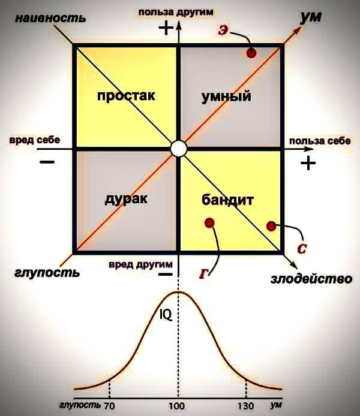

# Psychology

---

Мать спросила своего ребёнка:

 - Знаешь ли ты, что Бог был здесь, когда ты крал печенье с кухни?
 - Да.
 - И что Он смотрел на тебя всё это время?
 - Да.
 - А что Он говорил тебе, как ты думаешь?
 - Он говорил: «Кроме нас здесь никого нет, возьми и мне немного!»

Энтони де Мелло "Когда Бог смеется "

---

Страдание – это ощущение напряжения в теле, которое порождено бесполезной
попыткой контролировать то, что происходит само по себе – жизнь!

Цезарь Теруэль

---

"В основном, свободу человек проявляет только в выборе зависимости".
Герман Гессе

---

 - Кем вы работаете?
 - Архитектором.
 - Девушка-архитектор, как интересно. А что строите?
 - Иллюзии.

 Ринат Валиуллин "Легкомыслие"

---

ЧУВСТВО ВИНЫ ВЗРОСЛЫХ, КОТОРЫХ СТЫДИЛИ В ДЕТСТВЕ

Характеристика взрослых, которых стыдили в детстве.

1. Взрослые, которых стыдили, когда они были детьми, боятся быть уязвимыми и страшатся самораскрытия (боятся раскрыться перед другими).
2. Взрослые, «которых стыдили в детстве, могут страдать от крайней застенчивости, смущения, замешательства и от чувства неполноценности по сравнению с другими. Они не считают, что они делают ошибки. Вместо этого они считают, что они сами являются ошибкой.
3. Взрослые, которых стыдили в детстве, боятся близости и склонны избегать обязательств, находясь во взаимоотношениях. Такие взрослые часто говорят, что у них такое чувство: будто одна нога всегда за дверью, чтобы убежать.
4. Взрослые, которых стыдили в детстве, могут казаться или очень высокомерными и эгоцентричными, или самоотверженными и бескорыстными.
5. Взрослые, которых стыдили в детстве, могут чувствовать, что «что бы я ни делал, это не имеет значения, я есть и всегда буду никчемным и нелюбимым».
6. Взрослые, которых стыдили в детстве, часто занимают оборонительную позицию, когда получают хотя бы незначительную отрицательную обратную связь. Они испытывают чувство крайнего унижения, если их вынуждают взглянуть на свои ошибки и несовершенства.
7. Взрослые, которых стыдили в детстве, часто обвиняют других за обвинения в свой адрес.
8. Взрослые, которых стыдили в детстве, могут страдать от разрушающего их чувства вины. Эти люди постоянно извиняется. Они берут на себя ответственность за поведение окружающих их людей.
9. Взрослые, которых стыдили в детстве, чувствуют себя чужаками. Они ощущают всеохватывающее чувство одиночества в течение всей своей жизни, даже если их окружают те, кто по-настоящему их любит и заботится о них.
10. Взрослые, которых стыдили в детстве, проецируют свои взгляды и свое отношение к себе на других. Они как «ясновидцы» читают мысли, которые явно им не льстят, и постоянно чувствуют, что другие их осуждают.
11. Взрослые, которых стыдили в детстве, часто злятся на других и осуждают в них те качества, которых они стыдятся в себе. Это может привести к тому, что они будут стыдить других.
12. Взрослые, которых стыдили в детстве, часто чувствуют себя безобразными, порочными и несовершенными.
13. Взрослые, которых стыдили в детстве, часто ощущают контроль, как извне, так и изнутри. Блокируются нормальные спонтанные проявления.
14. Взрослые, которых стыдили в детстве, чувствуют, что они должны все делать идеально или не делать вообще. Это внутреннее убеждение часто приводит к тревоге при выполнении чего-либо, а также к оттягиванию, затягиванию и проволочкам.
15. Взрослые, которых стыдили в детстве, часто испытывают депрессию.
16. Взрослые, которых стыдили в детстве, врут себе и другим.
17. Взрослые, которых стыдили в детстве, блокируют чувство стыда посредством различного рода компульсивного поведения, такого как трудоголизм, нарушения в приеме пищи, покупки, злоупотребление химическими веществами, азартные игры.
18. Взрослые, которых стыдили в детстве, вместо дружбы несут тяжелое бремя чужих проблем.
19. Взрослые, которых стыдили в детстве, часто компульсивно уходят в копание в прошлых взаимоотношениях, в событиях прошлого, в интеллектуализацию, чтобы защититься от боли.
20. Взрослые, которых стыдили в детстве часто застревают в зависимости или становятся ее ярыми противниками.
21. Взрослые, которых стыдили в детстве, не имеют ощущения эмоциональных границ, они чувствуют, что другие люди постоянно вторгаются в их пределы. Они часто строят фальшивые границы путем возведения стен из ярости, ублажения и изоляции.
    Характеристика взаимоотношений взрослых, в основу личности которых заложен стыд:
1. Мы теряем себя в любви.
2. Когда мы спорим, мы сражаемся ни на жизнь, а на смерть.
3. Мы тратим огромное количество энергии, пытаясь догадаться, что у других на уме. Когда мы разговариваем со своим партнером о его чувствах и нуждах, то мы часто говорим с самим собой, а не с ним.
4. Мы платим высокую цену за то хорошее, что с нами было.
5. Мы, беря на себя обязательства, зачастую подписываем два контракта: один сознательно, другой – бессознательно.
6. Мы обвиняем и нас обвиняют.
7. Мы хотим, чтобы он/она ушли, а потом боремся за то, чтобы они вернулись.
8. Мы знаем, что все будет по-другому, но ожидаем, что все останется по-старому.
9. Мы часто чувствуем, что наши партнеры контролируют наше поведение.
10. В других нас часто привлекают те эмоциональные характеристики, в обладании которыми мы отказали себе.
11. Мы часто создаем треугольники во взаимоотношениях.
12. Мы стремимся получить от наших партнеров любовь, которую не получили в детстве, полном стыда.

    Как нас стыдили в детстве?

    Ниже следуют примеры взаимодействия между детьми и взрослыми, с которыми они росли, в результате чего у детей могло возникнуть чувство стыда.

1. Ребенок может испытывать чувство стыда, когда родители и другие взрослые, воспитывающие его, посредством слов или/и поведения давали ему понять, что он нежеланный. Ребенок может получить такое сообщение еще в младенчестве через ощущение того, как к нему прикасаются, как его держат, и как с ним взаимодействуют ухаживающие за ним взрослые.
2. Когда ребенка стыдят и унижают публично, это откликается в нем усилением чувства стыда.
3. Когда проявляется неодобрение по отношению к ребенку, как таковому, а не к определенному проступку или его поведению. Пример: «Ты – очень плохой мальчик». А не «Толик, мне не нравится, когда ты бьешь сестренку. Я понимаю, что тебе трудно, и ты не можешь добиться от неё желаемого, но я не хочу, чтобы ты опять бил её».
4. Когда для того, чтобы его принимали, ребенку приходится скрывать какую-либо часть себя, формируется стыд. Примеры: Необходимость скрывать ошибки, потребности, радости, горести, болезнь, успех, слезы.
5. У ребенка формируется стыд, когда нарушаются эмоциональные и физические границы ребенка, что происходит при физическом или сексуальном оскорблении в прямой или скрытой форме. У ребенка не может развиться собственная личность, если между родителями и ребенком не существует четких границ. Физическое или сексуальное оскорбление, – исходящее от окружающих ребенка людей, ведет к чувству, что «я не достоин любви, меня не принимают таким, какой я есть. Меня можно любить меньше, когда …”. Кроме того, ребенок растет в мире секретов, чувствуя, что «я постоянно должен скрываться и прятаться от глаз других людей».
6. Когда дети чувствуют, что им негде уединиться, некуда спрятаться, то они вырастают с всепоглощающим чувством неадекватности и думают: «Должно быть, я на самом деле плохой человек». Примеры: Родители, которые роются в вещах своих детей, подслушивают их телефонные разговоры, читают их письма или делают заявления типа: «Я знаю, что ты думаешь», « Если бы ты меня любил, ты бы мне обо всем рассказывал».
7. Если взрослые относятся безразлично или игнорируют важные для детей события или подарки, ребенок испытывает сильное чувство стыда. Примеры: Ребенок целый день трудится, делая для мамы рисунок. Мать не находит времени, чтобы взглянуть на него, убирает его, прячет в куче других вещей или говорит: «И что мне с этим делать?» Когда родители упорно не посещают важные для ребенка мероприятия, не играют с ним в мяч, не ходят на вечеринки, организуемые для родителей с детьми или на спектакли, то у ребенка развивается чувство, что он или она просто не очень важны.
8. Когда, сравнивая, ребенок чувствует, что его родители чем-то отличаются от других, обладающих властью фигур в окружающем мире, ребенок может начать ощущать стыд по отношению к своей семье, а через это начать стыдиться себя. Это чувство отличия иногда приводит к расколу, ребенок разрывается, пытаясь быть верным семье и окружающему миру. Это приводит к тому, что ребенок начинает скрывать какую-то часть своего мира и таким образом часть себя от другой своей части. Примеры: Дети, родители которых являются иммигрантами, чья речь, обычаи и привычки отличаются от внешнего мира, в котором живет семья. Дети национальных меньшинств, где в окружающем их мире, цвет кожи стал отождествляться с такими отрицательными качествами, как порочность, лень, бессилие или беспомощность. Дети, живущие в нищете, где недостаток денег или вещей заставляет их считаться неприемлемыми для общества.
9. Когда ребенок чувствует, что родители или члены семьи имеют какой-то дефект или недостаток по сравнению с другими фигурами взрослых в его мире; у ребенка развивается стыд. Пример: Дети из семей, где один из членов алкоголик или наркоман, чье поведение ставит ребенка в неловкое положение и смущает. Дети из семей, где один из ее членов умственно или физически неполноценен и где это отличие никогда не обсуждается, или же ребенок не может выразить свое чувство смущения и неловкости по этому поводу.
10. Когда у ребенка подорвано или разрушено доверие к фигуре значимого взрослого в результате его непосредственного поведения и пренебрежения ребенком, то ребенок испытывает замешательство относительно того «Где мое место и принадлежность и чего я могу ожидать от мира в целом». Это чувство рассоединенности или недостатка причастности приводит к возрастанию внутреннего стыда и изоляции.
11. Когда ребенок растет с взрослыми, испытывающими чувство стыда и собственного бессилия в мире, у ребенка также развивается чувство стыда. Стыд заразен.
12. Когда ребенка вынуждают чувствовать себя нежелательным, нелюбимым, порочным или никчемным в более широком контексте школьного мира или общества, у такого ребенка развивается парализующий его стыд. Пример: Дети, испытывающие трудности при обучении чтению по причине не обнаруженной неспособности к обучению, чувствуют себя ленивыми или глупыми благодаря поведению и высказываниям взрослых. Дети, которые из-за невнимания и пренебрежения дома приходят в школу в неподобающем виде и гигиеническом состоянии. В школе и в окружающем их обществе они оказываются в изоляции, терпят насмешки и взгляды, полные отвращения. К некоторым детям добронамеренные взрослые испытывают сочувствие, что усиливает их чувство ненадежности и неуверенности, отсутствия уважения к себе и бессилия в окружающем мире.
13. Когда ребенка постоянно обвиняют за поступки и эмоциональное состояние взрослых, несущих ответственность за воспитание ребенка, и когда ребенок никак не может понять, что от него ожидают, не говоря о том, чтобы выполнять эти ожидания, у него развивается калечащее его чувство вины и стыда. Пример: ребенок чувствует: «Если бы я был умнее, сильнее, симпатичнее, тогда бы мои родители меньше пили, были бы счастливее и реже погружались в депрессию».
14. Когда ребенок не может жить в соответствии с ожиданиями растящих его взрослых из-за того, что эти ожидания непоследовательны или нереалистичны для этого конкретного ребенка в силу его возрастных способностей и особенностей или из-за того, что он просто человек, то ребенок чувствует себя никчемным, нелюбимым, неудачником, ошибкой. Таким образом, образуется и увековечивается ядовитый стыд, лишающий человека силы.
15. Когда родители или взрослые, занимающиеся воспитанием ребенка, используют в качестве дисциплинарной меры в ответ на поведение ребенка молчаливое отвращение, ребенок чувствует, что он весь, все его существо – плохое, порочное, Когда молчаливое отвержение используется как наказание, то для ребенка вероятность восстановления и исправления взаимоотношений очень мала. Ребенок остается с чувством непоправимой вины за свое поведение и с парализующим его стыдом.

    Пример: Толик приносит из школы домой записку, в которой говорится, что он подрался на перемене. Вечером он показывает записку родителям. Они читают записку и смотрят на Толика с отвращением. Со вздохом они кладут записку на стол текстом вниз. Родители Толика уходят, оставляя его одного в комнате. То, что произошло в школе, не обсуждается. Завершения нет.

    Автор: Джейн Миддлтон-Моз

---

A bit controversial, but still nice.

Настоящему мужчине не плевать, сколько у девушки было половых партнёров до него. И настоящей девушке не безразличен, с кем раньше был её парень.
Есть одна замечательная фраза: « Ключ, открывающий много замков, – хороший ключ, а замок, который открывает много ключей, – плохой замок ». И это истина дорогие друзья, но с небольшой оговоркой, к которой мы вернёмся в заключении. Всё дело в доступности секса для мужчин и для женщин. Что нужно мужчине, чтобы получить секс? Ну, возьмём среднестатистический сценарий. Ему необходимо иметь хотя-бы среднюю внешность, определенный социальный статус и достаток, уметь привлечь к себе внимание девушки, «добиться» девушку тратя финансовые и «энергетические» ресурсы, суметь вызвать у неё доверие к себе, прождать какое-то время, и лишь затем возлечь с ней в постель. Если мужчина не олень, у него хорошая внешность и харизма, то дела явно будут проще, но всё равно, это не всегда будет легко. А теперь зададимся вопросом, что нужно девушке для того, чтобы получить секс? Дать. Всё, просто дать. Другу, массажисту, турецкому официанту, таксисту, неизвестному парню на вписке. Просто дать. Если девушка среднестатистической наружности. Если девушка полная или не выделяется красотой, то ей необходимо как-то привлечь к себе внимание мужчины. А потом дать. Кажется факт того, как труднодоступен секс для мужчин и легкодоступен для женщин – очевиден. И женщины это прекрасно понимают, и, прося в ответ девственника – откровенно блефуют, ибо для многих девушек - это далеко не положительная характеристика мужчины. Не утверждаем, что женщинам нужны мужчины, что переспали со множеством женщин, но наличие хоть какого-то опыта для них - это скорее плюс, чем минус.
А теперь зададимся противоположным вопросом, что делать мужчине и женщине, чтобы сохранить целомудрие? У мужчин всё просто – не пытаться. Просто не пытаться, если он не статный красавец или у него не хороший банковский счёт, вряд-ли кто-то попытается затащить его в постель. А что нужно девушке? Нужно быть избирательной, не поддаваться эйфории первой влюблённости, уметь отказывать, избегать «тусовок» где её могут напоить и воспользоваться, не быть доверчивой простушкой, да и в целом быть скромной, воспитанной и иметь голову на плечах. При том, что девушкам секс нужен не меньше чем мужчинам, это задача не простая.
Для мужчины честь иметь рядом с собой девушку, которой удалось себя сохранить для него. Женщины называют таких мужчин неуверенными в себе. Но что прибавляет больше уверенности в себе мужчине? То, что его спутница жизни отшила десяток мужчин до него и доверилась исключительно ему? Или то, что его женщина, перепробовав десяток "вариантов", решила всё-таки остановиться на нём? Ответ думаю – очевиден.
Так что дорогие девушки, как говорится - берегите платье снову, а честь смолоду. А мужчины, не забывайте, что ключ, открывающий много замков – это уже не ключ, а отмычка, которая ничем не брезгует.

---

Поговорка “Не учите меня жить, лучше помогите материально” нашла научное подтверждение. Американские экономисты и психологи при помощи крупной гуманитарной организации провели масштабный эксперимент в одном из самых бедных регионов Кении, население которого к тому же часто страдает от психологических проблем, в первую очередь депрессии, беспокойства и стресса. Одной части населения региона раздали по 50 тысяч кенийских шиллингов (чуть меньше 500 долларов, очень существенная для этой страны сумма). Для другой части провели пятинедельный курс психотерапии и тренинга решения проблем по методике Problem Management Plus, разработанного ВОЗ. В третьей группе люди получили и деньги и психотерапию. Население региона, не получившее ни того ни другого, служило в качестве контрольной группы. Всего в исследовании приняло участие почти 6000 семей.

Через год учёные вернулись в Кению, чтобы посмотреть результаты эксперимента. Вот что они увидели:

У группы, которая получила деньги, за год в среднем на 26% выросли доходы (большинство открыло собственный мелкий бизнес), на 20% выросло потребление (в первую очередь на улучшение жилищных условий, выросли также медицинские расходы и расходы на образование, а расходы на алкоголь, табак и прочие “искушения“, наоборот, упали) и на 47% выросла стоимость имущества (в основном за счёт покупки машин и скота). К тому же у них заметно выросло субъективное ощущение удовлетворённости жизнью.

Группа, которая вместо денег получила психотерапию, за год никак не улучшила ни своё материальное положение, ни даже своё субъективное ощущение радости жизни. Единственным статистически значимым результатом курса психологической помощьи неожиданно стало заметное повышение неудовлетворенности браком и уровня насилия в семье. То есть прошедшие курс психологической помощи мужья стали существенно чаще бить своих жён — или, по крайней мере, жёны стали более открыто в этом признаваться.

Материальное и психологическое положение участников группы, получившей и деньги и психотерапию, тоже улучшилось — но, что интересно, в среднем приблизительно на треть меньше, чем у людей, которых не учили жить, а просто помогли материально.

https://www.nber.org/papers/w28106

---

Hot and Crazy MATRIX / Cute and Money MATRIX
https://www.youtube.com/watch?v=R_USJCTIgs4

---

Как формируется любовь Михаил Лабковский
https://www.youtube.com/watch?v=ay-KEQc_3aM

Как относиться к жизни проще.
https://www.youtube.com/watch?v=juLroeYTL7o

---

9 фраз, которые поставят на место высокомерного человека

 1. Извини, друг, у меня нет столько времени на притворство, как у тебя сегодня.
 2. Ммм..извини, я не слушал. Можешь повторить, что ты сейчас сказал?
 3. Ладно. (Такой простой ответ показывает собеседнику, что вам в общем-то все равно)
 4. От тебя это звучит странно.
 5. Ты всегда такой наглый, или только когда я рядом?
 6, Как скажешь, дурачок.
 7. Я не понимаю, что ты сейчас говоришь. Я не говорю на абсурдном языке.
 8. Было больно падать с неба? Если человек спросит вас почему ответьте ему: Потому что, похоже, ты приземлился лицом на землю.
 9. Спасибо, что подумал обо мне. Пока.

---

ФОБИЯ – МЕХАНИЗМ ФОРМИРОВАНИЯ

Фобии бывают разные. Сегодня я хочу вам рассказать о механизме формирования фобии. Практически любой фобии. Этот механизм достаточно простой и понятный.

Как из страха вырастить фобию своими руками?

Рассмотрим этот механизм на примере моей помощницы Клубнички.

Избегание. Клубничка боится летать на самолете. Страх полета на самолете буквально парализует ее. Поэтому Клубничка прибегает к самой распространенной попытке решения проблемы. Она просто на просто избегает лететь на самолете. Ездит только на поезде или на машине. Это, конечно ограничивает ее жизнь, но… уж лучше так путешествовать, чем никак. Как вы думаете к чему это приводит? Ее страх уменьшается или только увеличивается? Конечно страх Клубнички только увеличивается!

Обращение за помощью. Также Клубничка боится ездить в метро, а недавних пор вообще на любом общественном транспорте. Однако, ей нужно поехать по делам за удобрениями для своих румяных щечек или к подружке Вишенке. Что же делает она в таком случае? Она уже не избегает поездки, а просит маму Клубнику поехать вместе с ней. Клубничка обращается за помощью, чтобы справиться со своим страхом. Как вы думаете к чему это приводит? Ее страх уменьшается или только увеличивается? Конечно страх Клубнички только увеличивается!

Контроль телесных ощущений. Когда Клубничке страшно, то ее организм вырабатывает адреналин, который просто необходим для того, чтобы выжить в ситуации опасности. Адреналин приводит активизирует работу центральной нервной системы это приводит к тому, что учащается пульс и сильнее начинает биться сердце. Клубничка пугается этого и, как кукла в впавшими внутрь глазами, старается уменьшить и контролировать свои телесные ощущения. И чем усердней она старается уменьшить эти ощущения, тем сильнее они выходят из-под контроля. Страх опять только увеличивается!

Все эти три стратегии уменьшения неприятных последствий страха на самом деле являются психологической ловушкой. Каждый раз, когда Клубничка избегает или обращается за помощью, то она подтверждает себе, что она не смогла справиться со своим страхом. Тем самым подтверждает свою несостоятельность и беспомощность перед проблемой. Страх только растет и становится мощней и изобретательней.

Вот таким образом страх превращается в самую настоящую фобию.

Это важно знать и запомнить! Если в течении 6 месяцев обращаться за помощью и просить защиты, избегать опасные ситуации, пытаться уменьшить или контролировать свои телесные ощущения, то у вас разовьется фобия.

Автор: Олег Сурков

---

From the facebook post.

# ЧЕМ ОПАСНЫ ИДИОТЫ?

Итальянский историк-экономист Карло Чиполла очень основательно подошел к вопросу о природе глупости. Долгие годы исследований привели ученого к тому, что он сформулировал пять универсальных законов, работающих в любом обществе. Оказалось, что глупость сама по себе намного опаснее, чем мы привыкли о ней думать.

## Первый закон глупости

Человек всегда недооценивает количество идиотов, которые его окружают. Звучит как размытая банальность и снобизм, но жизнь доказывает его истинность. Как бы вы ни оценивали людей, вы постоянно будете сталкиваться со следующими ситуациями:

Человек, который всегда выглядел умным и рациональным, оказывается невероятным идиотом;

Глупцы все время возникают в самых неожиданных местах в самое неподходящее время, чтобы разрушить ваши планы.

## Второй закон глупости

Вероятность того, что человек глуп, не зависит от других его качеств. Годы наблюдений и опытов утвердили меня в мысли, что люди не равны, одни глупы, другие нет, и это качество закладывается природой, а не культурными факторами. Человек является глупцом так же, как он является рыжим или имеет первую группу крови. Он таким родился по воле Провидения, если хотите. Образование не имеет ничего общего с вероятностью наличия определенного числа глупцов в обществе. Это подтвердили многочисленные эксперименты в университетах над пятью группами: студенты, офисные служащие, обслуживающий персонал, сотрудники администрации и преподаватели. Когда я анализировал группу низкоквалифицированных сотрудников, число глупцов оказалось большим, чем я ожидал (Первый закон), и я списал это на социальные условия: бедность, сегрегацию, недостаток образования. Но поднимаясь выше по социальной лестнице, то же соотношение я увидел среди белых воротничков и студентов. Еще более впечатляющим оказалось увидеть то же число среди профессуры — брал ли я маленький провинциальный колледж или крупный университет, та же доля преподавателей оказывалась глупцами. Я был так поражен результатами, что решил провести эксперимент над интеллектуальной элитой — Нобелевскими лауреатами. Итог подтвердил суперсилы природы: то же определенное количество лауреатов были глупы.

Идею, которую выражает Второй закон, сложно принять, но многочисленные эксперименты подтверждают ее железобетонную правоту. Феминистки поддержат Второй закон, поскольку он гласит, что дур среди женщин не больше, чем дураков среди мужчин. Жители стран третьего мира утешатся тем, что развитые страны не такие уж и развитые. Выводы из Второго закона пугают: станете ли вы вращаться в британском высшем обществе или переедете в Полинезию, подружившись с местными охотниками за головами; заточите ли вы себя в монастыре или проведете остаток жизни в казино в окружении продажных женщин, вам везде придется сталкиваться с таким же количеством идиотов, которое (Первый закон) всегда будет превышать ваши ожидания.

## Третий закон глупости

Глупец — это человек, чьи действия ведут к потерям для другого человека или группы людей и при этом не приносят пользы самому действующему субъекту или даже оборачиваются вредом для него. Третий закон предполагает, что все люди делятся на 4 группы: простаки (П), умники (У), бандиты (Б) и глупцы (Г). Если Петя предпринимает действие, от которого несет потери и при этом приносит выгоду Васе, то он относится к простакам (зона П). Если Петя делает нечто, что приносит выгоду и ему, и Васе, он умник, потому что действовал умно (зона У). Если действия Пети несут ему выгоду, а Вася от них страдает, то Петя — бандит (зона Б). И наконец, Петя-глупец находится в зоне Г, в минусовой зоне по обеим осям. Нетрудно вообразить масштабы урона, который способны нанести дураки, попадая в управленческие органы и обладая политическими и социальными полномочиями. Но отдельно стоит уточнить, что именно делает дурака опасным.

Глупые люди опасны потому, что рациональные люди с трудом могут представить логику неразумного поведения. Умный человек способен понять логику бандита, потому что бандит рационален — он всего лишь хочет получить больше благ и при этом недостаточно умен, чтобы заработать их. Бандит предсказуем, потому против него можно выстроить защиту. Спрогнозировать действия глупца невозможно, он навредит вам без причины, без цели, без плана, в самом неожиданном месте, в самое неподходящее время. У вас нет способов предугадать, когда идиот нанесет удар. В конфронтации с дураком умный человек полностью отдает себя на милость дурака, рандомного создания без понятных умнику правил.

Атака глупца обычно застает всех врасплох. Даже когда атака становится очевидной, от нее сложно защититься, потому что она не имеет рациональной структуры.

## Четвертый закон глупости

Не-глупцы всегда недооценивают разрушительный потенциал глупцов. В частности, не-глупцы постоянно забывают о том, что иметь дело с дураком, в любой момент времени, в любом месте и при любых обстоятельствах, означает совершать ошибку, которая дорого обойдется в будущем. Простаки из зоны П обычно не способны распознать опасность дураков из зоны Г, что неудивительно. Удивительно как раз то, что глупцов также недооценивают и умники, и бандиты. В присутствии глупца они расслабляются и наслаждаются своим интеллектуальным превосходством вместо того, чтобы срочно мобилизоваться и минимизировать ущерб, когда дурак что-нибудь выкинет. Распространенный стереотип — что дурак вредит лишь самому себе. Нет. Не нужно путать дураков с беспомощными простаками. Никогда не вступайте в альянс с дураками, воображая, что можете использовать их ради своей выгоды, — если вы так поступите, то очевидно, что вы не понимаете природы глупости. Так вы сами предоставляете дураку поле, на котором он может разгуляться и нанести больший урон.

## Пятый закон глупости

Глупец — самый опасный тип личности. Следствие: глупец опаснее, чем бандит. Результат действий идеального бандита — простой переход благ от одного человека к другому. Обществу в целом от этого ни холодно, ни жарко. Если бы все члены этого социума были идеальными бандитами, оно бы тихо гнило, но катастрофы бы не случилось. Вся система сводилась бы к трансферу богатств в пользу тех, кто предпринимает ради этого действия, и поскольку идеальными бандитами были бы все, система наслаждалась бы стабильностью. Это легко видеть на примере любой страны, где власти коррумпированы, а граждане постоянно обходят законы.

Когда на сцену выходят дураки, картина полностью меняется. Они наносят урон, не извлекая выгоды. Блага уничтожаются, общество беднеет.

История подтверждает, что в любой период страна прогрессирует тогда, когда у власти находится достаточно умных людей, чтобы сдерживать активных дураков и не давать им разрушить то, что умники произвели.

В регрессирующей стране дураков столько же, однако среди верхушки наблюдается рост доли глупых бандитов, а среди остального населения — наивных простаков. Такая смена расклада неизменно усиливает деструктивные последствия действий дураков, и вся страна катится к чертям.

---

ЛАБКОВСКИЙ - КАК ПРАВИЛЬНО ВЫБРАТЬ ПАРТНЕРА ДЛЯ ЖИЗНИ
https://www.youtube.com/watch?v=4w5RD3VHeJg

---

6 Signs Someone Isn’t Worth Your Time

https://medium.com/wholistique/6-signs-someone-isnt-worth-your-time-50a0d17fc643

"In my experience, people who make cruel jokes like testing the waters. If you
react negatively, they’ll take it back and insist they were just joking and you
should just lighten up. But if you agree, they’ll let the cruelty run free."

---

Наказание также несет в себе и другие побочные эффекты. Это занижение 
чувства собственного достоинства, или поведение, продиктованное чувством
страха; это смешанное чувство обиды, нанесенной вам человеком, на любовь
которого вы рассчитывали; это укрепление веры в то, что действовать с
позиции силы — единственный способ добиться того, чего хочешь. Кроме
того, наказание делает ребенка недоверчивым и побуждает скрывать свои
ошибки.
Кэтрин Кволс "Радость воспитания. Как воспитывать детей без наказания"

---

Interesting facts about people not remembering how 'g' is drawn
https://www.iflscience.com/brain/most-people-cant-recognize-a-letter-they-see-every-day-and-you-probably-cant-either/
https://psycnet.apa.org/record/2018-13691-001

---

8 great things that happen when you lose control
https://www.cluber.com.ua/lifestyle/psihologiya-lifestyle/2019/11/8-zamehatelnyh-veshej-kotorye-proishodyat-posle-togo-kak-vy-otpuskaete-kontrol/

---

5 sex conversations to have before you date
https://www.elephantjournal.com/2019/10/5-sex-conversations-to-have-before-starting-a-new-relationship-adult-benjamin-davis/

---

11 СПОСОБОВ НЕ ЗАБЫВАТЬ ПРОЧИТАННОЕ 
Когда мы читаем что-то интересное, хочется удержать в памяти все детали. Но проходит время — и мы обнаруживаем, что не можем вспомнить не только детали, но даже суть. 
Провалы в памяти? Склероз? Ничего подобного. Просто читать и запоминать — это два разных процесса. Чтобы удержать информацию в голове, память нужно включить. Вот 11 способов, которые помогут это сделать.
1. Ароматное чтение 
Случалось вам когда-нибудь, зайдя в комнату, ощутить запах мебели и сразу что-то вспомнить? «Вау, будто я у бабушки дома» или «Помнишь тот старый отель?» 
Обоняние тесно связано с памятью, потому что место, где находятся анализаторы запахов, расположено очень близко от участка мозга, контролирующего память. Ученые обнаружили, что если дети сдают экзамен в комнате с таким же запахом, при котором проходили занятия, то они справляются лучше тех, кто сдает экзамен в комнате без аромата. 
Лайфхак: когда читаете, нюхайте любимые цветы, духи или эфирное масло. Когда понадобится вспомнить информацию, снова вдохните этот же аромат. 
2. Связь с местом 
Связь с местом тоже помогает вспомнить информацию. Это подтверждает забавное исследование: шести дайверам дали список из 40 слов. 20 слов они учили на берегу, еще 20 — под водой. Затем дайверов протестировали, один раз на берегу, другой раз под водой. Слова, которые они учили под водой, лучше вспоминались под водой, и наоборот. 
Если вы читаете в своей спальне, то и вспомнить прочитанное легче всего там. Но не бежать же в спальню каждый раз, когда нужно чем-то поделиться. Используйте лайфхак. 
Лайфхак: найдите вещь, которая напомнит вам об атмосфере спальни: подушку, светильник, плед. Мысленно перенеситесь в спальню, и память заработает. 
3. Общая картина 
Детали запомнить легче, если встраивать их в общую картину. Вот как ученые это выяснили. Они предложили двум группам студентов прочитать детективный роман. Участники одной группы получали его по одной странице, переходя к следующей только после прочтения предыдущей. Участников другой группы попросили сначала прочитать заключение, чтобы они знали, кто и почему совершил убийство. А потом им дали книгу полностью. 
Группа, читавшая роман постранично, потратила на него на 30% больше времени, а понимание текста оказалось хуже. Группа, которая сначала получила «общую картину», поняла текст на 38% лучше. Более того, формирование общей картины позволяет запомнить информацию на более долгий срок. 
Лайфхак: постарайтесь сложить общую картину. Если нужно — загляните в конец. Так можно 
4. Образы 
Мозг воспринимает информацию не словами, а изображениями. Одно из самых известных доказательств тому — парадокс Бейкера — бейкера. Участникам эксперимента дали фотографию человека. Одну группу попросили запомнить, что фамилия человека на фотографии — Бейкер, другую — что его профессия пекарь (по-английски — «бейкер»). 
Через две недели их спросили, что они могут вспомнить — фамилию или профессию. Участники, которым сказали, что человек, о котором идет речь, пекарь по профессии, смогли это легко вспомнить. А из участников, которых просили запомнить имя, только один смог его воспроизвести. 
Объяснить это можно следующим: когда вы думаете о профессии пекаря, то представляете образ человека, что-то пекущего. Это просто визуализировать. Запомнить имя Бейкер не так просто — оно не создает в вашем мозге никаких образов, если только вы не знаете человека с таким же именем. 
Лайфхак: читая, преобразуйте слова в образы, прокручивайте в голове собственный фильм. Через изображения информация четко и точно записывается в память. 
5. Цель 
Запомнить вообще всё невозможно. Поставьте перед собой конкретную цель — и вы сможете читать гораздо быстрее, запоминая именно то, что нужно. 
Чтобы поставить цель, вам стоит задать себе два вопроса. 
Насколько значим тот материал, который я читаю? 
Что я хочу или должен запомнить (настолько конкретно, насколько это возможно) из материала, который собираюсь прочесть? 
Лайфхак: начните определять цель при любом чтении, даже если это всего лишь текст на коробке хлопьев. Обычно на это уходит не более секунды, а эффект потрясающий. 
6. Заметки на полях 
Как мы уже говорили, чтение и запоминание — это разные виды деятельности. Чтобы включить память, нужны дополнительные действия: заметки на полях, выделение важных мыслей, подчеркивание. Так вы лучше запомните материал по ходу чтения и сможете восстановить его позже, просто пробежавшись по заметкам. 
Лайфхак: делайте заметки на полях или выделяйте цветом важные мысли в электронных книгах. 
7. Используйте свой багаж 
Чем больше у вас предшествующих знаний по определенному предмету, тем лучше запоминается новая информация по этой теме. Новое связывается с уже известным, опирается на имеющийся фундамент. 
Перед работой с новым материалом целесообразно заранее вспомнить все, что уже известно по этой теме. Таким образом мозг подготовится к новой информации и сформирует нужную установку. 
Лайфхак: прежде чем начать читать книгу, вспомните всё, что вам уже приходилось читать или слышать по этой теме. 
8. Образ врага 
Чтобы лучше сконцентрироваться на информации, попробуйте такой способ: представьте, что текст, который вы читаете, написал ваш враг. Если вы ищете ошибки и неточности текста, то заметно лучше концентрируетесь и больше запоминаете. 
Тот же самый прием можно использовать, когда вы слушаете аудиокнигу и не можете на ней сосредоточиться. Начните искать противоречия, чтобы можно было возразить чтецу (не обязательно делать это на самом деле). Таким образом, вы извлекаете пользу из негативных качеств — желания возражать, критиковать, привязываться к словам. 
Лайфхак: настройтесь враждебно. Вслушивайтесь в каждое слово, чтобы найти подвох. 
9. Пересказ 
Похожий прием — пообещать себе пересказать текст после того, как он будет прочитан. Даже если вы на самом деле не собираетесь его пересказывать, но дали себе слово, что будете, — концентрация внимания усилится. Вы начнете читать, пропуская несущественную информацию и удерживая внимание на самом важном, что достойно упоминания при пересказе. 
Лайфхак: пообещайте себе пересказать текст. Еще лучше — сделайте это. 
10. Чередуйте дела 
Из-за заученного ранее материала происходит забывание нового. Влияние тем сильнее, чем больше сходства с предыдущей деятельностью. Если вы пять часов читали о философии Фихте, а потом без всякого отдыха перешли к Канту, то мысли Канта в вашей памяти могут спутаться — и, скорее всего, спутаются — с мыслями предыдущего философа. 
Лайфхак: При переходе от одной книги или главы к другой сделайте перерыв — выпейте кофе, прогуляйтесь, помойте посуду. 
11. Лучше много раз помалу, чем помногу мало раз 
Лучше всего запоминается информация, полученная в начале и конце. Подумайте о какой-нибудь книге, фильме или разговоре — начало и конец всегда отчетливо выделяются в памяти. Поэтому ежедневное чтение короткими фрагментами предпочтительнее, чем длительное от корки до корки. 
Лайфхак: Не пытайтесь проглотить книгу от начала до конца — так вы забудете всё, что было в середине. Читайте небольшими фрагментами. 
По материалам книг «Как запоминать (почти) всё и всегда», «Как читать, запоминать и никогда не забывать», «Помнить всё», «Скорочтение»

---

PBS series about implicit bias.
Hacking Your Mind. Living on Autopilot. 09/09/2020 
https://www.pbs.org/video/living-on-auto-pilot-5p5jct/

---

Социальное программирование на примере трех экспериментов 
Эксперимент № 1: 
За столом сидит около десяти детей. Несколько детей имеют установку на то, что и как говорить. На столе
стоят две пирамиды — одна белая, другая черная. Ведущая начинает спрашивать детей: 
— Машенька, какого цвета пирамидки? 
— Обе белые. 
— Коля, какого цвета пирамидки? 
— Обе белые. 
Так до тех пор, пока не подходит очередь «не подставного ребенка». После небольшого раздумывания он тоже
говорит: «обе белые». Потом ведущая просит ребенка подвинуть к себе черную пирамидку. И ребенок пододвигает.
И потом не может ответить на вопрос, почему он до этого сказал: «обе белые». 

Эксперимент № 2: 
В лифт заходит несколько человек, из которых один — подопытный, остальные — знают условия эксперимента.
В один момент времени все мужчины снимают шляпы, подопытный после секундного замешательства тоже снимает.
Затем участники эксперимента поворачиваются синхронно налево — испытуемый после паузы тоже. И так
продолжается несколько раз. 

Эксперимент № 3: 
Клетка. В ней пять обезьян. К потолку подвязана связка бананов. Под ними лестница. Проголодавшись,
одна из обезьян подошла к лестнице с явными намерениями достать банан. Как только она дотронулась до
лестницы, вы открываете кран и со шланга поливаете ВСЕХ обезьян очень холодной водой. Проходит немного
времени, и другая обезьяна пытается полакомиться бананом. Те же действия с вашей стороны. 
Отключите воду. 
Третья обезьяна, одурев от голода, пытается достать банан, но остальные хватают ее, не желая холодного
душа. А теперь уберите одну обезьяну из клетки и замените ее новой обезьяной. Она сразу же, заметив
бананы, пытается их достать. К своему ужасу, она увидела злые морды остальных обезьян, атакующих ее.
После третьей попытки она поняла, что достать банан ей не удастся. Теперь уберите из клетки еще одну
из первоначальных пяти обезьян и запустите туда новенькую. Как только она попыталась достать банан,
все обезьяны дружно атаковали ее, причем и та, которую заменили первой (да еще с энтузиазмом). 
И так, постепенно заменяя всех обезьян, вы придете к ситуации, когда в клетке окажутся пять
обезьян, которых водой вообще не поливали, но которые не позволят никому достать банан. Почему?
Потому, что здесь так заведено. 
Общество умеет транслировать написанные кем-то и когда-то социальные законы, зачастую просто не
понимая их смысла. Слабые духом, а их значительно больше девяносто пяти процентов населения,
просто принимают правила игры — даже не понимая, зачем и для чего они это делают. Здесь так
заведено, и точка. Так правильно. Делай, что говорят взрослые.

---

Is Success Luck or Hard Work?
https://www.youtube.com/watch?v=3LopI4YeC4I

---

Interesting article saying that human brain can only deal with 5-9 things at a time.

Brain Compatible Programming
https://tobeva.com/articles/brain-compatible-code/

---

8 Congnitive Biases in Software Development
https://thevaluable.dev/cognitive-bias-software-development/

- The optimistic bias
- The overconfidence bias
- The confirmation bias
- Wishful thinking
- The anchoring bias
- The bandwagon effect
- The cargo cult
- The correspondence bias

12 hurtful cognitive biases and how to overcome them. (VERY NICE read)
https://dev.to/x-team/12-hurtful-cognitive-biases-and-how-to-overcome-them-2m9j

- confirmation bias (favor what confirms to your pre-existing beliefs)
- availability heuristic (placing greater value on what comes to mind quickly)
- self-server bias (blaming external forces when something bad happens, but take credit when something good happens)
- anchoring bias (relying too heavily on the first piece of information you receive)
- survivorship bias (the focus on what remains standing, instead of taking into account that which you cannot see)
- zero-risk bias (focusing on eliminating all the rist on one aspect of a problem instead of reducing the overall risk
  in the entire problem)
- the bandwagon effect (favoring certain things or beliefs simply because other people do or believe the same things)
- loss aversion (losing something hurts people more than winning the same thing makes people happy; the endowment effect:
  we give something greater value simply because we own it)
- sunk cost fallacy (continuing on an irrational path of action, just because we've invested so much time and/or money in it already)
- the law of triviality, bikeshedding (the tendency of people in an organization to spend disproportionate amounts of time on
  trivial issues and details instead of spending that time on what will make a big difference in the organization.
- cluster illusion (tendency to see patterns in random events, when correlation does not mean causation)
- conservatism bias (tendencey to favor prior evidence over new evidence, to revise our beliefs insufficiently in the
  face of new evidence.

More on cognitive bias
https://en.wikipedia.org/wiki/Cognitive_bias

---

How to change someone's mind.
https://hbr.org/2020/07/how-to-actually-change-someones-mind

---

Documentary about Jejune project, The Institute. About alternative reality for the thrill seekers.
https://tubitv.com/movies/136727/the_institute

---

Nice analysis of the Mouse Utopia experiment
https://www.youtube.com/watch?v=bkpCf2YILCc

- single female mice with no companions move upstairs,
- single male mice with no companions move to the center and fight.
- Brzezinski's term "tittytainment" is to distract the 80% of
  population from realizing they are being used by 20% elite.

People are to become a domestic animal raised by elites.

---

We stay in the same age where we did not have enough attention.
https://fit4brain.com/9210

---

10+ Habits of Toxic Parents and How They Ruin Children Without Realizing It.
https://www.higherperspectives.com/toxic-parent-2493937590.html

---

What happens if you leave Facebook:
https://www.calnewport.com/blog/2020/02/29/top-economists-study-what-happens-when-you-stop-using-facebook/

- “Deactivating Facebook freed up 60 minutes per day for the average person in our Treatment group.”
  Much of this time was reinvested in offline activities, including, notably, socializing with friends and family.  
- “Deactivation caused small but significant improvements in well-being, and in particular in self-reported
 happiness, life satisfaction, depression, and anxiety.” The researchers report this effect to be around 25-40%
 of the effect typically attributed to participating in therapy.  
- “As the experiment ended, participants reported planning to use Facebook much less in the future.” Five percent
 of the Treatment group went even farther and declined to reactivate their account after the experiment ended.  
- “The Treatment group was less likely to say they follow news about politics or the President, and less able
 to correctly answer factual questions about recent news events.” This was not surprising given that this group
 spent 15% less time reading any type of online news during the experiment.
- “Deactivation significantly reduced polarization of views on policy issues and a measure of exposure to
 polarizing news.” On the other hand, it didn’t significantly reduce negative feelings about the other political party.

This study validates many of the ideas from Digital Minimalism (indeed, the paper even cites the book in its
 introduction). People spend more time on social media than they realize, and stepping away frees up time for
 more rewarding offline activities, leading, in turn, to an increase in self-reported happiness and a decrease
 in self-reported anxiety.

Perhaps most interesting was the disconnect between the subjects’ experience with deactivating Facebook and
their prediction about how other people would react. “About 80 percent of the Treatment group agreed that
deactivation was good for them,”

---

The Bystander Effect: The Death of Kitty Genovese
https://www.youtube.com/watch?v=BdpdUbW8vbw

---

Confirming with the group experiment. Standing up when there is a beep.
https://www.youtube.com/watch?v=Ia9aE3RH1Uc

---

About leaving in the right time, early.
fit4brain.com/10266

---

Humans are hardwired to dismiss facts that don’t fit their worldview
https://theconversation.com/humans-are-hardwired-to-dismiss-facts-that-dont-fit-their-worldview-127168

(See it in Motivation.md)

---

Experimentally Produced Social Problems in Rats 1939
https://www.youtube.com/watch?v=si4uof3Y-Wo

---

Bobo Doll Experiment, about observation of violence
https://www.youtube.com/watch?м=zerCK0lRjp8

---

Nunchi, a Korean concept of fitting in.
https://en.wikipedia.org/wiki/Nunchi

---

Rats free trapped companions, even when given choice of chocolate instead.
https://news.uchicago.edu/story/helping-your-fellow-rat-rodents-show-empathy-driven-behavior

---

The Dr. Fox effect is a correlation observed between teacher expressiveness, content coverage, student evaluation
and student achievement. This effect also allows insight to other related effects and relationships between student
achievement and evaluations of the teacher. 
https://en.wikipedia.org/wiki/Dr._Fox_effect

---

Psychological manipulation of the masses: https://lifter.com.ua/10-strashnyh-tryukov-s-pomoshchyu-kotoryh-kontroliruyut-massy-rasskazyvaet-noam-homskiy-5293

---

Nice summary of well-known experiments:
https://medium.com/@mikaileliyah/how-your-mind-can-be-hijacked-and-your-will-seized-ae71141f6996

---

Interesting study on weekdays(publicly-available)
https://journals.plos.org/plosone/article?id=10.1371/journal.pone.0134555

---

Mouse universe experiment, ‘Rats of NIMH’, https://www.youtube.com/watch?v=0Z760XNy4VM

---

12 способов простить обиды своим родителям

1. Постарайтесь не простить, а понять
У них не было ресурса
Помните, что у них была очень тяжелая жизнь – работа, нехватка денег, добывание еды, трудоемкий быт, стояние в очередях. Сильно замотанные родители не были психологически чувствительными и давали детям тот ресурс, на который их хватало.

2. Они были молодые и неопытные
Иногда бывает очень полезно вспомнить, в каком возрасте были ваши родители в то время. Часто это были люди 25-26 лет, неопытные и неуверенные.

3. Не надо молчать
Если вы чувствуете обиду на родителей, не надо молчать об этом. Нельзя не признавать того, что вам было плохо. Очень долго эта тема была табуирована и был только один вариант: «Родители святые люди, они тебя вырастили и дали жизнь, их нужно любить, уважать и не жаловаться» или: «Если тебе было плохо – сам виноват».

4. Не носитесь всю жизнь с детскими травмами
Это другая крайность. Хорошо бы не провести всю свою жизнь, жалуясь на родителей и объясняя их ошибками все свои неудачи. Постарайтесь не прожить всю жизнь под знаменем «ребенок алкоголика», «человек, которого не любила мама» или « человек, которого в детстве били». Иногда такой период переживания травмы нужен, но хорошо бы, чтобы он заканчивался.

Когда мы были детьми, у нас не было выбора – будут нас обижать или нет. А сейчас у нас есть выбор – мы можем оставить травму просто как опыт или позволить травме формировать нашу личность.

5. Если не получается соскочить с этого своими силами – обратитесь к психотерапевту, не надо жить в таком состоянии годами.

6. Попробуйте поговорить о детских обидах с родителями
Нужно ли пытаться донести до родителей, что они были не правы? Иногда это помогает. Родители стали спокойнее, мудрее, они уже не такие замотанные, как раньше. Они уже воспитывают внуков и часто открывают в себе качества тепла и принятия. Некоторые из них уже готовы на такой разговор. Иногда они могут признать и выразить сожаление о прошлых ошибках. И это может стать началом новых теплых отношений.

Иногда признание ответственности просто необходимо
В основном это касается случаев, когда был серьезный абьюз со стороны родителей. Просто признать, что это было. Это признание часто может стать единственным условием, на котором дети согласны дальше общаться с родителями. Нужно сказать прямым текстом: «Мне очень важно, чтобы ты признал, что это было. Мне не нужно извинений, но важно, чтобы никто не делал вид, что я это придумал».

7. Оставьте за ними право не признавать своих ошибок
Если родители защищаются и говорят: «Мы все делали правильно, это ты неблагодарный», – они имеют на это право. У вас своя картина мира, а у них своя. Иногда их психика все отрицает и вытесняет. Перевоспитывать человека в 70 лет это плохая затея.

Но часто это означает, что близких отношений между вами уже не будет.

8. Пожалейте себя маленького
Когда мы получаем обиды от родителей, мы находимся в положении очень маленького существа. Вы не судья, а просто маленький ребенок, у которого не было выбора. А когда мы думаем - прощать или не прощать, то принимаем на себя ответственность, которой у нас нет и быть не могло. Мы не можем быть старше родителей, не можем судить их «сверху». Мы можем признать свои чувства и из сегодняшнего взрослого состояния пожалеть себя маленького. Объяснить себе маленькому, что вообще-то так нельзя с детьми поступать, чтобы он хоть от кого-то взрослого это услышал.

9. Разрешите себе погрустить
В какой-то момент надо разрешить себе погрустить и признать, что чего-то у вас в детстве не было и уже не будет. Потому что ваши родители просто не могли вам это дать. И от этого может стать полегче.

10. Не ждите, что родители изменятся
Очень часто за претензиями к родителям стоит детская надежда, что родители изменятся – папа, наконец, похвалит, а мама, наконец, полюбит. А папа и мама не хвалили и не любили просто потому, что они в принципе были на это не способны. У них свое тяжелое детство, свои обстоятельства и свой психологический профиль.

11. Научитесь переводить язык любви своих родителей
Довольно редко бывают родители, которые совсем не способны ничего давать, а только критикуют и отвергают. Иногда их язык любви просто не тот, который нам бы хотелось услышать. Мы ждем хороших слов, а их любовь – это печь нам пироги и кормить до отвала.

Надо научиться переводить их язык на свой. Допустим, мама все время ворчит, но при этом готовит вам бесконечные борщи и моет посуду. Вот эти ее пироги, борщ и посуда и есть ее «я тебя люблю».

12. Иногда критика – это тоже забота
Бесконечная критика - это такой родительский оберег. Кажется, что если все время говорить ребенку, что с ним не так, то он когда-то все поймет и будет, наконец, все делать правильно. Если увидеть это с такой стороны, то это не будет вас так разрушать. Надо научиться к этому так и относиться, как к заботе.

Если ваши родители умерли, то ваши претензии им точно не навредят
Умерший родитель не так уж отличается от не умершего. Ведь когда мы обижаемся, мы обижаемся не на сегодняшних родителей, а на тех родителей, которые были тогда, в момент обиды.

Иногда умерших идеализируют и кажется, что запрещено подумать о них плохо или предъявлять к ним претензии. Но если они уже умерли, то ваши претензии им точно никак не навредят, а вам это может помочь.

Людмила Петрановская

---